#HTML

##  从输入url到页面加载完成的过程

* 首先做 DNS 查询，如果这一步做了智能 DNS 解析的话，会提供访问速度最快的 IP 地址回来
    * 操作系统会首先在本地缓存中查询
    * 没有的话会去系统配置的 DNS 服务器中查询
    * 如果这时候还没得话，会直接去 DNS 根服务器查询，这一步查询会找出负责 com 这个一级域名的服务器
    * 然后去该服务器查询 google 这个二级域名
    * 接下来三级域名的查询其实是我们配置的，你可以给 www 这个域名配置一个 IP，然后还可以给别的三级域名配置一个 IP 
* 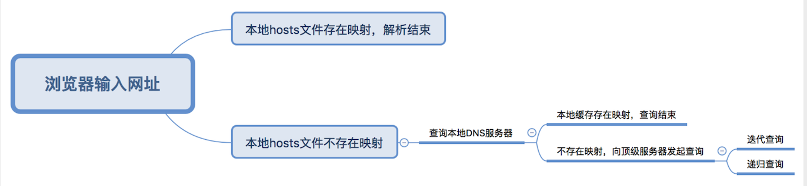
  
* 接下来是 TCP 握手，应用层会下发数据给传输层，这里 TCP 协议会指明两端的端口号，然后下发给网络层。网络层中的 IP 协议会确定 IP 地址，并且指示了数据传输中如何跳转路由器。然后包会再被封装到数据链路层的数据帧结构中，最后就是物理层面的传输了

* TCP 握手结束后会进行 TLS 握手，然后就开始正式的传输数据

* 数据在进入服务端之前，可能还会先经过负责负载均衡的服务器，它的作用就是将请求合理的分发到多台服务器上，这时假设服务端会响应一个 HTML 文件

* 首先浏览器会判断状态码是什么，如果是 200 那就继续解析，如果 400 或 500 的话就会报错，如果 300 的话会进行重定向，这里会有个重定向计数器，避免过多次的重定向，超过次数也会报错

* 浏览器开始解析文件，如果是 gzip 格式的话会先解压一下，然后通过文件的编码格式知道该如何去解码文件

* 文件解码成功后会正式开始渲染流程，先会根据 HTML 构建 DOM 树，有 CSS 的话会去构建 CSSOM 树。如果遇到 script 标签的话，会判断是否存在 async 或者 defer ，前者会并行进行下载并执行 JS，后者会先下载文件，然后等待 HTML 解析完成后顺序执行，如果以上都没有，就会阻塞住渲染流程直到 JS 执行完毕。遇到文件下载的会去下载文件，这里如果使用 HTTP 2.0 协议的话会极大的提高多图的下载效率。

* 初始的 HTML 被完全加载和解析后会触发 DOMContentLoaded 事件
  CSSOM 树和 DOM 树构建完成后会开始生成 Render 树，这一步就是确定页面元素的布局、样式等等诸多方面的东西

* 在生成 Render 树的过程中，浏览器就开始调用 GPU 绘制，合成图层，将内容显示在屏幕上了

    ### 下面详细分析客户端为了访问服务器而执行的一系列关于协议的操作

    1. 客户端浏览器通过DNS解析到www.baidu.com的IP地址220.181.27.48，通过这个IP地址找到客户端到服务器的路径。客户端浏览器发起一个HTTP会话到220.161.27.48，然后通过TCP进行封装数据包，输入到网络层。
    2.   在客户端的传输层，把HTTP会话请求分成报文段，添加源和目的端口，如服务器使用80端口监听客户端的请求，客户端由系统随机选择一个端口如5000，与服务器进行交换，服务器把相应的请求返回给客户端的5000端口。然后使用IP层的IP地址查找目的端。
    3.   客户端的网络层不用关系应用层或者传输层的东西，主要做的是通过查找路由表确定如何到达服务器，期间可能经过多个路由器，这些都是由路由器来完成的工作，不作过多的描述，无非就是通过查找路由表决定通过那个路径到达服务器。
    4. 客户端的链路层，包通过链路层发送到路由器，通过邻居协议查找给定IP地址的MAC地址，然后发送ARP请求查找目的地址，如果得到回应后就可以使用ARP的请求应答交换的IP数据包现在就可以传输了，然后发送IP数据包到达服务器的地址。

## 什么是HTML5的基本构件

* 语义 - 提供更准确地描述内容。

  * 语义化更好的内容标签（header,nav,footer,aside,article,section）

* 连接 - 提供新的方式与服务器通信。

  * 新的技术webworker, websocket

* 离线和存储 - 允许网页在本地存储数据并有效地离线运行。

  *  LocalStorage与SessionStorage

* 多媒体 - 在 Open Web 中，视频和音频被视为一等公民（first-class citizens）。
  * 音频、视频API(audio,video)
  * 还有一些其他的API：
     * 拖拽释放(Drag and drop) [API](https://juejin.im/post/5a169d08518825592c07c666)
     * 画布(Canvas) [API](http://www.w3school.com.cn/html5/html_5_canvas.asp)
     * 地理(Geolocation) [API](http://www.w3school.com.cn/html5/html_5_geolocation.asp)

* 2D/3D 图形和特效 - 提供更多种演示选项。

   * translate() 根据左(X轴)和顶部(Y轴)位置给定的参数，从当前元素位置移动。
     `transform: translate(50px,100px);`

   * rotate() 在一个给定度数顺时针旋转的元素。负值是允许的，这样是元素逆时针旋转。
     `transform:rotate(30deg);`

   * scale() 该元素增加或减少的大小，取决于宽度（X轴）和高度（Y轴）的参数：
     `transform: scale(2,2);`

   * skew() skewX(<angle>);表示只在X轴(水平方向)倾斜 / skewY(<angle>);表示只在Y轴(垂直方向)倾斜。

   * ```css
      transform: skew(30deg,20deg);
      -ms-transform: skew(30deg,20deg); /* IE 9 */
      -webkit-transform: skew(30deg,20deg); /* Safari and Chrome */
     ```

   * matrix() 方法有六个参数，包含旋转，缩放，移动（平移）和倾斜功能。
     `transform:matrix(0.866,0.5,-0.5,0.866,0,0);`

* 性能和集成 - 提供更快的访问速度和性能更好的计算机硬件。

* 设备访问 - 允许使用各种输入、输出设备。

* 外观 - 可以开发丰富的主题。

##  webSocker

**产生的原因**：*因为 HTTP 协议有一个缺陷：通信只能由客户端发起。*

**最大特点**：服务器可以主动向客户端推送信息，客户端也可以主动向服务器发送信息，是真正的双向平等对话，属于[服务器推送技术](https://en.wikipedia.org/wiki/Push_technology)的一种。

**特点：**

* 建立在 TCP 协议之上，服务器端的实现比较容易。
* 与 HTTP 协议有着良好的兼容性。默认端口也是80和443，并且握手阶段采用 HTTP 协议，因此握手时不容易屏蔽，能通过各种 HTTP 代理服务器。
* 数据格式比较轻量，性能开销小，通信高效。
* 可以发送文本，也可以发送二进制数据。
* 没有同源限制，客户端可以与任意服务器通信。
* 协议标识符是`ws`（如果加密，则为`wss`），服务器网址就是

```js
var ws = new WebSocket("wss://echo.websocket.org");

ws.onopen = function(evt) { 
  console.log("Connection open ..."); 
  ws.send("Hello WebSockets!");
};

ws.onmessage = function(evt) {
  console.log( "Received Message: " + evt.data);
  ws.close();
};

ws.onclose = function(evt) {
  console.log("Connection closed.");
};  
```

#### webSocket.readyState

- CONNECTING：值为0，表示正在连接。
- OPEN：值为1，表示连接成功，可以通信了。
- CLOSING：值为2，表示连接正在关闭。
- CLOSED：值为3，表示连接已经关闭，或者打开连接失败。

```js
switch (ws.readyState) {
  case WebSocket.CONNECTING:
    // do something
    break;
  case WebSocket.OPEN:
    // do something
    break;
  case WebSocket.CLOSING:
    // do something
    break;
  case WebSocket.CLOSED:
    // do something
    break;
  default:
    // this never happens
    break;
}
```

####  webSocket.onopen

实例对象的`onopen`属性，用于指定连接成功后的回调函数。

```js
ws.onopen = function () {
  ws.send('Hello Server!');
}
```

如果有多个回调函数：

```js
ws.addEventListener('open', function (event) {
  ws.send('Hello Server!');
});
```

####  webSocket.onclose

实例对象的`onclose`属性，用于指定连接关闭后的回调函数。

```js
ws.onclose = function(event) {
  var code = event.code;
  var reason = event.reason;
  var wasClean = event.wasClean;
  // handle close event
};

ws.addEventListener("close", function(event) {
  var code = event.code;
  var reason = event.reason;
  var wasClean = event.wasClean;
  // handle close event
});
```

#### webSocket.onmessage

实例对象的`onmessage`属性，用于指定收到服务器数据后的回调函数

```js
ws.onmessage = function(event) {
  var data = event.data;
  // 处理数据
};

ws.addEventListener("message", function(event) {
  var data = event.data;
  // 处理数据
});
```

#### webSocket.send()

实例对象的`send()`方法用于向服务器发送数据。

```js
ws.send('your message');
```

文件对象

```js
var file = document
  .querySelector('input[type="file"]')
  .files[0];
ws.send(file);
```

#### webSocket.bufferedAmount

实例对象的`bufferedAmount`属性，表示还有多少字节的二进制数据没有发送出去。它可以用来判断发送是否结束。

```js
var data = new ArrayBuffer(10000000);
socket.send(data);

if (socket.bufferedAmount === 0) {
  // 发送完毕
} else {
  // 发送还没结束
}
```

#### webSocket.onerror

实例对象的`onerror`属性，用于指定报错时的回调函数。

```js
socket.onerror = function(event) {
  // handle error event
};

socket.addEventListener("error", function(event) {
  // handle error event
});
```

常用的 Node 实现有以下三种。

- [µWebSockets](https://github.com/uWebSockets/uWebSockets)
- [Socket.IO](http://socket.io/)
- [WebSocket-Node](https://github.com/theturtle32/WebSocket-Node)


##webWorker

####产生webWorker的原因：

JavaScript引擎是单线程运行的，JavaScript中耗时的I/O操作都被处理为异步操作，它们包括键盘、鼠标I/O输入输出事件、窗口大小的resize事件、定时器(setTimeout、setInterval)事件、Ajax请求网络I/O回调等，即使有event loop 但是过于复杂的运算页面还是很容易触发假死状态。
#### 类型：
Web workers可分为两种类型：

* 专用线程dedicated web worker
* 共享线程shared web worker。

> Dedicated web worker随当前页面的关闭而结束；这意味着Dedicated web worker只能被创建它的页面访问。与之相对应的Shared web worker可以被多个页面访问。在Javascript代码中，“Work”类型代表Dedicated web worker，而“SharedWorker”类型代表Shared web worker。
而Shared Worker则可以被多个页面所共享（同域情况下）
#### subWorker
> subWorker 我们可以在一个 Worker 脚本中去实例化另一个 Worker，这成为子 Worker，但是这个特性目前大部分浏览器还未实现，所以不展开阐述。

#### 创建Webworker[数据通信]
我们可以调用全局函数 postMessage 和给全局的 onmessage 赋值来发送和监听数据和事件：
`onmessage`: 监听事件`postmessage`: 传送事件

```js
// main.js
    var worker = new Worker('./worker.js')
    worker.onmessage = function (e) {
       console.log('MAIN: ', 'RECEIVE', e.data)
    }
   // console.log('i am main.js')
   worker.postMessage('i am main')
```
```js
// worker.js
      // console.log('webWorkerRun')
      onmessage = function (e) {
          console.log('worker test:','receive',e.data)
          postMessage('i am worker')
     }
```
```html
//index.js
<!DOCTYPE html>
<html lang="">
<head>
    <meta charset="UTF-8">
    <title>CrossOrigin</title>
</head>
<body>
<div>webWorker</div>
<pre id="test-response-text"></pre>
</body>
<script src="main.js"></script>
</html>

```
这个时候浏览器可以看到console

```
worker test: receive i am main
main.js:3 MAIN:  RECEIVE i am worker 
```
说明有worker
#### 终止worker
```js
// 方式一 main.js 在主线程停止方式 
var worker = new Worker('./worker.js');
...
worker.terminate();

// 方式二、worker.js
self.close()
```
#### 错误机制

```js
worker.addEventListener('error', function (e) {
  console.log('MAIN: ', 'ERROR', e);
  console.log('filename:' + e.filename + '-message:' + e.message + '-lineno:' + e.lineno);
});

// event.filename: 导致错误的 Worker 脚本的名称；
// event.message: 错误的信息；
// event.lineno: 出现错误的行号；
```

#### worker 的环境和作用域
他还是可以获取到部分浏览器提供的 API 的：

* setTimeout()， clearTimeout()， setInterval()， clearInterval()：有了设计个函数，就可以在 Worker 线程中执行定时操作了；
* XMLHttpRequest 对象：意味着我们可以在 Worker 线程中执行 ajax 请求；
* navigator 对象：可以获取到 ppName，appVersion，platform，userAgent 等信息；
* location 对象（只读）：可以获取到有关当前 URL 的信息；

#### 库或外部脚本引入和访问
在线程中，提供了importScripts方法

```js
// main.js
        var worker = new Worker('./worker1.js');
```
```js
// worker1.js
        console.log('hello, I,m worker 1');
        importScripts('worker2.js', 'worker3.js');
```
```js
// worker2.js
        console.log('hello, I,m worker 2');
```
```js
// worker3.js
        console.log('hello, I,m worker 3');
```
#### 通信原理

从一个线程到另一个线程的通讯实际上是一个值拷贝的过程，实际上是先将数据`JSON.stringify`之后再`JSON.parse`。
#### 应用场景
* 使用专用线程进行数学运算
    * Web Worker最简单的应用就是用来做后台计算，而这种计算并不会中断前台用户的操作
* 图像处理
  * 通过使用从`<canvas>`或者`<video>`元素中获取的数据，可以把图像分割成几个不同的区域并且把它们推送给并行的不同Workers来做计算
*  大量数据的检索
   * 当需要在调用 ajax后处理大量的数据，如果处理这些数据所需的时间长短非常重要，可以在Web Worker中来做这些，避免冻结UI线程。
*  背景数据分析
   * 由于在使用Web Worker的时候，我们有更多潜在的CPU可用时间，我们现在可以考虑一下JavaScript中的新应用场景。例如，我们可以想像在不影响UI体验的情况下实时处理用户输入。利用这样一种可能，我们可以想像一个像Word（Office Web Apps 套装）一样的应用：当用户打字时后台在词典中进行查找，帮助用户自动纠错等等。

#### 限制

1. 不能访问DOM和BOM对象的，Location和navigator的只读访问，并且navigator封装成了WorkerNavigator对象，更改部分属性。无法读取本地文件系统
2. 子线程和父级线程的通讯是通过值拷贝，子线程对通信内容的修改，不会影响到主线程。在通讯过程中值过大也会影响到性能（解决这个问题可以用transferable objects）
3. 并非真的多线程，多线程是因为浏览器的功能
4. 兼容性
5. 条数限制，大多浏览器能创建webworker线程的条数是有限制的，虽然可以手动去拓展，但是如果不设置的话，基本上都在20条以内，每条线程大概5M左右，需要手动关掉一些不用的线程才能够创建新的线程（相关解决方案）
6. js存在真的线程的东西，比如SharedArrayBuffer

# css3

### 常用元素

* 常用块级元素

```html
<adress> <block> <quote> <center> <div> <form> <h1> <menu> <p> <table> <ol> 有序 <ul>无序
```

* 常用内联元素

```html
<a> <br> <code> <i> <input> <q> <small> <span> <strong>  <em> 
```

* 块级元素和内联元素的区别

  * 行内元素会在一条直线上排列（默认宽度只与内容有关），都是同一行的，水平方向排列。

  *  块级元素各占据一行（默认宽度是它本身父容器的100%（和父元素的宽度一致），与内容无关），垂直方向排列。块级元素从新行开始，结束接着一个断行。

  * 块级元素可以包含行内元素和块级元素。行内元素不能包含块级元素，只能包含文本或者其它行内元素。

    3.行内元素与块级元素属性的不同，主要是盒模型属性上：行内元素设置width无效，height无效(可以设置line-height)，margin上下无效，padding上下无效

* 行内元素和块级元素转换

  * display:block; (字面意思表现形式设为块级元素)
  * display:inline; (字面意思表现形式设为行内元素)

## 关于position定位

* static定位
  * static定位是HTML元素的默认值，即没有定位，元素出现在正常的流中	
* fixed固定定位
  * fixed定位是指元素的位置相对于浏览器窗口是固定位置，即使窗口是滚动的它也不会滚动，且fixed定位使元素的位置与文档流无关，因此不占据空间，且它会和其他元素发生重叠。
* relative相对定位
  * 相对定位元素的定位是相对它自己的正常位置的定位。
  * 即使相对元素的内容移动了，但是预留空间的元素仍然保存在正常流动
* absolute绝对定位
  * 绝对定位的元素相对于最近的已定位父元素，如果元素没有已定位的父元素，那么它的位置相对于<html>。
* sticky粘性定位
  * 粘性定位是相对定位和固定定位的混合。元素在跨越特定阈值前为相对定位，之后为固定定位

### 水平垂直居中

####  内联元素居中方案

* 水平居中：
  * 行内元素 设置 text-align:center；
  * Flex布局 设置父元素display:flex;  justify-content:center;(灵活运用)

* 垂直居中
  * 父元素高度确定的单行文本（内联元素） 设置 height = line-height；
  * 父元素高度确定的多行文本（内联元素）
    * a:插入 table （插入方法和水平居中一样），然后设置vertical-align:middle；
    * b:先设置 display:table-cell 再设置 vertical-align:middle；

####  块级元素居中方案

* 水平居中

  * 定宽元素：设置左右margin:auto;

  * 不定宽元素：

    * 在元素外加入 table 标签（完整的，包括 table、tbody、tr、td），该元素写在 td 内，然后设置 margin 的值为 auto；

    * ```html
      <table>  
       <tbody>  
         <tr>
      	   <td>
      	     <div>  
      		    设置我所在的div容器水平居中    
      	     </div>  
      	   </td>
         </tr>  
       </tbody>  
      </table>  
      ```

    * 给该元素设置 display:inline（或inline-block） ；父元素设置text-align：center

    * 父元素设置 float:left；position:relative 和 left:50%，子元素设置 position:relative 和 left:-50%

* 垂直水平居中

  * 使用position:absolute（fixed）,设置left、top、margin-left、margin-top的属性(定高);

  * ```css
    .box {
      width: 200px;
      height: 200px;
      background: red;
      position: absolute;/*或fixed*/
      top: 50%;
      left: 50%;
      margin-top: -100px;
      margin-left: -100px;
    }
    ```

  * 利用position:fixed（absolute）属性，margin:auto这个必须不要忘记了(定高);

  * ```css
    .box{
        width: 100px;
        height: 100px;
        background: red;
        position: absolute;/*或fixed*/
        top:0;
        right:0;
        bottom:0;
        left:0;
        margin: auto;
    }
    ```

  * 利用给父元素加display:table-cell属性使内容垂直居中,这个方法在多行文字居中的时候用的比较多;

    ```css
    <div class="box">
        <span>多行文字，此处居中设置</span>
    </div>
    .box{
        display: table-cell;
        vertical-align: middle;
        text-align: center;
        width: 100px;
        height: 120px;
        background: purple;
    }
    .box span{
        display: inline-block;
        vertical-align: middle;
    }
    ```

  * 使用css3的新属性transform:translate(x,y)属性(不定高，不定宽);

    * 当使用：top: 50%;left: 50%;， 是以左上角为原点，故不处于中心位置
    *  translate(-50%,-50%) 作用是，往上（x轴）,左（y轴）移动自身长宽的 50%，以使其居于中心位置

  * 使用before，after伪元素(定高不定宽);

    ```css
    <div class='box'>
        <div class='content'>
            垂直居中
        </div>
    </div>
    .box{
        display: block;
        background: rgba(0,0,0,.5);
        height: 100px;
    }
    .content::before{
        content: '';
        display: block;
        vertical-align: middle;
        height: 100%;
    }
    .content::after{
        content: '';
        display: block;
        vertical-align: middle;
        height: 100%;
    }
    .box .content{
        height: 33px;
        line-height: 33px;
        text-align: center;
    }
    ```

  * Flex布局(不定高，不定宽);

  * ```css
    .box{
        display: flex;
        /*水平居中*/
        justify-content: center;
        /*垂直居中*/
        align-items: center;
    }
    ```

### Flex 布局

<https://juejin.im/post/58e3a5a0a0bb9f0069fc16bb#comment>

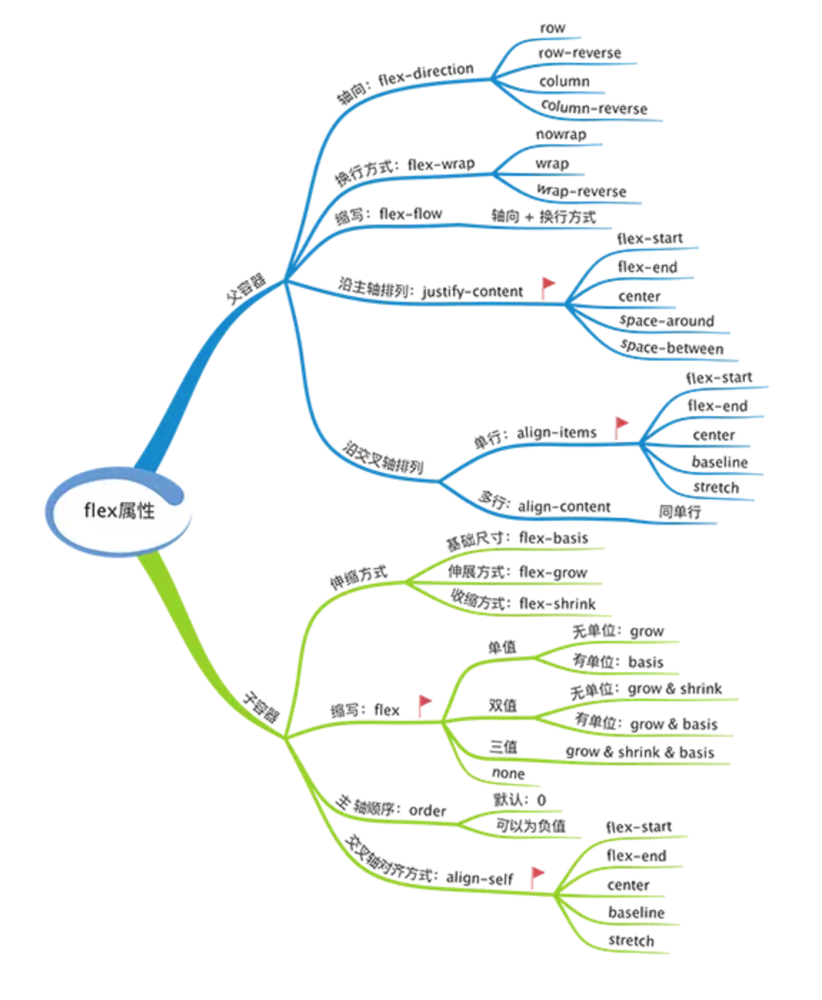

### css预处理

### rem

相对比的是  根元素 HTML 的 font-size

单位描述%百分比  /  in英寸cm厘米mm毫米em

1em / 等于当前的字体尺寸。

2em 等于当前字体尺寸的两倍。 

例如，如果某元素以 12pt 显示，那么 2em 是24pt。

在 CSS 中，em 是非常有用的单位，因为它可以自动适应用户所使用的字体。

ex一个 ex 是一个字体的 x-height。 (x-height 通常是字体尺寸的一半。)pt磅 (1 pt 等于 1/72 英寸)pc12 点活字 (1 pc 等于 12 点)px像素 (计算机屏幕上的一个点)

##  Sass Less Stylus异同： postCss

**1.变量：**

- Sass声明变量必须是『$』开头，后面紧跟变量名和变量值，而且变量名和变量值需要使用冒号：分隔开。
- Less 声明变量用『@』开头，其余等同 Sass。
- Stylus 中声明变量没有任何限定，结尾的分号可有可无，但变量名和变量值之间必须要有『等号』。但需要注意的是，如果用“@”符号来声明变量，Stylus会进行编译，但不会赋值给变量。就是说，Stylus 不要使用『@』声明变量。Stylus 调用变量的方法和Less、Sass完全相同。

**2.作用域：**

css 预编译器把变量赋予作用域，也就是存在生命周期。就像 js 一样，它会先从局部作用域查找变量，依次向上级作用域查找。

- Sass：三者最差，不存在全局变量的概念。也就是说在 Sass 中定义了相同名字的变量时你就要小心蛋疼了。
- Less：我认为跟 JS 一样，逐级查找，向上冒泡。
- Stylus：完全等同 Less。Stylus 和 Sass 则更倾向于指令式。

**3.嵌套：**

十分真诚的说，三种 css 预编译器的「选择器嵌套」在使用上来说没有任何区别（也可能是我没发现）。Sass 除了常规的采用『&』替代父级选择器之外，还提供了「奇葩的属性嵌套」：

```sass
/*style.sass*/
.footer {
  font: {
    family:  微软雅黑;
    size: 5rem;
    weight: bolder;
  }
}
```

除了少打几个字，感觉没啥用啊。

**4.继承：**

css 属性的继承是一个非常重要的特性，好消息是三种预编译器都对此做出了改善。

- Sass和Stylus的继承非常像，能把一个选择器的所有样式继承到另一个选择器上。使用『@extend』开始，后面接被继承的选择器。

```sass
.shit {
  margin: 10px 5px;
  padding: 2px;
}
p {
  @extend .shit;/*继承.block*/
  border: 1px solid #aaa;
}
ul,li {
  @extend .shit; /*继承.block*/
  color: #aaa;
}
```

将被编译成标准 css：

```css
.shit,p,ul,ol {
  margin: 10px 5px;
  padding:2px;
}
p {
  border: 1px solid #aaa
}
ul,li {
  color:#aaa;
}
```

- Less 继承：与前两者继承方式有所区别，它不是在选择器上继承，而是将Mixins中的样式嵌套到每个选择器里面。然而这样会带来一个明显的缺点：每个选择器中会出现重复的样式。

**5.导入@Import：**

CSS中，不建议用@import导入css，因为会增加http请求。但 CSS 预处理器中的导入和CSS的有hhe很大区别，它是将不同 css 是在语义上导入，最终编译结果会生成一个CSS文件。

值得注意的是，如果不同文件相互引入的时候，出现相同变量名时可能会引起错误。所以我的建议是单独有一个 var.sass/less/styl 文件来记录所有你定义的变量。

Less 为@Import 扩展了语法，而 Sass 和 Stylus 并没有。具体扩展的 import 语法请见：[Less 的 Import 扩展](https://link.zhihu.com/?target=http%3A//less.bootcss.com/features/%23import-options)

## PostCSS的简要原理

PostCSS自身只包括css分析器，css节点树API，source map生成器以及css节点树拼接器。

css的组成单元是一条一条的样式规则（rule），每一条样式规则又包含一个或多个属性&值的定义。所以，PostCSS的执行过程是，先css分析器读取css字符内容，得到一个完整的节点树，接下来，对该节点树进行一系列转换操作（基于节点树API的插件），最后，由css节点树拼接器将转换后的节点树重新组成css字符。期间可生成source map表明转换前后的字符对应关系：


比较有意思的是，PostCSS的插件其实都是JavaScript函数，它们使用PostCSS的节点树API，对css节点树进行不同的转换。


# JS

## 基本数据类型

基本类型有六种： `null`，`undefined`，`boolean`，`number`，`string`，`symbol`

> 保存的是基本类型数据，基本类型的变量是存放在栈内存（Stack）里的

`undefined` 定义了但未赋值

`null` 定义并赋值了 值为null `var b= null` 初始赋值为null 表示后来要赋值为object  最后 `b=null`释放内存**让b指向的对象为垃圾对象**

引用数据类型：`Object`

细分*有：*`Object 类型`*、*`Array 类型`*、*`Date 类型`*、*`RegExp 类型`*、*`Function 类型` *等。*

> 保存的是地址值，引用类型的值是保存在堆内存（Heap）中的对象（Object）

需要进行深拷贝的数据类型是**Date**和**Object**

### 数据，内存，变量

数据：存储在内存中，代表特定信息，本质上是0101

内存：通电后产生可存储数据的空间(临时)

变量：每个变量对应一小块内存，变量名用来查找对应内存，变量值是内存中的数据

```javascript
var obj1={name:'Tom'}
var obj2=obj1
obj2.age=12
console.log(obj1.age)//12
function fn(obj){
  obj.name='A'
}
fn(obj1)
console.log(obj2.name)//A
var a={age:12}
var b=2
a={name:'BoB',age:13}
b.age=14
console.log(b.age,a.age)//14 BoB 13

function fn(obj){
 obj={age:15}
}
fn(a)
console.log(a.age)//13 a的指针没有变

var a=2
function fn2(a) {
    a=a+2
    console.log('123')
    return a
}
fn2(a)
console.log(a)//2 fn(a)函数内存
```

##  判断数据类型


### typeof

返回数据类型的`字符串表达式`  undefined/数字/字符串/布尔值/function/symbol

不能判断 null -> object /array->object /object->object

### instanceof

`instanceof` 可以正确判断对象的类型，因为内部机制是通过判断对象的原型链中是不是找到类型`prototype`

```js
function instanceof(left, right) {
    // 获得类型的原型
    let prototype = right.prototype
    // 获得对象的原型
    left = left.__proto__
    // 判断对象的类型是否等于类型的原型
    while (true) {
    	if (left === null)
    		return false
    	if (prototype === left)
    		return true
    	left = left.__proto__
    }
}
var b1 = {
  b2:[1,'abc',console.log],
  b3: function(){
    console.log('b3')
  }
}
console.log(b1 instanceof Object)
console.log(b1.b2 instanceof Object,b1.b2 instanceof Array) //true true
console.log(b1.b3 instanceof Object,b1.b3 instanceof Function) //true true
// b1 ：是实例对象； Object： 是构造函数
```


###  ===

可以判断undefined/null

### 万能的判断

`Object.prototype.toString.call(xx)`。这样我们就可以获得类似 `[object Type]`的字符串


## js内置对象属性和方法汇总

JavaScript有3大对象，分别是`本地对象`、`内置对象`和`宿主对象`。

- 本地对象
  - 与宿主无关，独立于宿主环境的ECMAScript实现提供的对象。
  - 简单来说，本地对象就是 ECMA-262 定义的类（引用类型）。
  - 这些引用类型在运行过程中需要通过new来创建所需的实例对象。
  - 包含：`Object`、`Array`、`Date`、`RegExp`、`Function`、`Boolean`、`Number`、`String`等。
- 内置对象
  - 与宿主无关，独立于宿主环境的ECMAScript实现提供的对象。
  - 在 ECMAScript 程序开始执行前就存在，本身就是实例化内置对象，开发者无需再去实例化。
  - 内置对象是本地对象的子集。
  - 包含：`Global`和`Math`。
  - ECMAScript5中增添了`JSON`这个存在于全局的内置对象。
- 宿主对象
  - 由 ECMAScript 实现的宿主环境提供的对象，包含两大类，一个是宿主提供，一个是自定义类对象。
  - 所有非本地对象都属于宿主对象。
  - 对于嵌入到网页中的JS来说，其宿主对象就是浏览器提供的对象，浏览器对象有很多，如`Window`和`Document`等。
  - 所有的`DOM`和`BOM`对象都属于宿主对象。

## Array

| 方法                                                         | 描述                                                         |
| :----------------------------------------------------------- | :----------------------------------------------------------- |
| [concat()](http://www.runoob.com/jsref/jsref-concat-array.html) | 连接两个或更多的数组，并返回结果。                           |
| [copyWithin()](http://www.runoob.com/jsref/jsref-copywithin.html) | 从数组的指定位置拷贝元素到数组的另一个指定位置中。           |
| [entries()](http://www.runoob.com/jsref/jsref-entries.html)  | 返回数组的可迭代对象。                                       |
| [every()](http://www.runoob.com/jsref/jsref-every.html)      | 检测数值元素的每个元素是否都符合条件。                       |
| [fill()](http://www.runoob.com/jsref/jsref-fill.html)        | 使用一个固定值来填充数组。                                   |
| [filter()](http://www.runoob.com/jsref/jsref-filter.html)    | 检测数值元素，并返回符合条件所有元素的数组。                 |
| [find()](http://www.runoob.com/jsref/jsref-find.html)        | 返回符合传入测试（函数）条件的数组元素。                     |
|                                                              |                                                              |
| [findIndex()](http://www.runoob.com/jsref/jsref-findindex.html) | 返回符合传入测试（函数）条件的数组元素索引。                 |
|                                                              |                                                              |
| [forEach()](http://www.runoob.com/jsref/jsref-foreach.html)  | 数组每个元素都执行一次回调函数。                             |
| [from()](http://www.runoob.com/jsref/jsref-from.html)        | 通过给定的对象中创建一个数组。                               |
|                                                              |                                                              |
| [includes()](http://www.runoob.com/jsref/jsref-includes.html) | 判断一个数组是否包含一个指定的值。                           |
| [indexOf()](http://www.runoob.com/jsref/jsref-indexof-array.html) | 搜索数组中的元素，并返回它所在的位置。                       |
| [isArray()](http://www.runoob.com/jsref/jsref-isarray.html)  | 判断对象是否为数组。                                         |
| [join()](http://www.runoob.com/jsref/jsref-join.html)        | 把数组的所有元素放入一个字符串。                             |
| [keys()](http://www.runoob.com/jsref/jsref-keys.html)        | 返回数组的可迭代对象，包含原始数组的键(key)。                |
| [lastIndexOf()](http://www.runoob.com/jsref/jsref-lastindexof-array.html) | 返回一个指定的字符串值最后出现的位置，在一个字符串中的指定位置从后向前搜索。 |
| [map()](http://www.runoob.com/jsref/jsref-map.html)          | 通过指定函数处理数组的每个元素，并返回处理后的数组。         |
| [pop()](http://www.runoob.com/jsref/jsref-pop.html)          | 删除数组的最后一个元素并返回删除的元素。                     |
| [push()](http://www.runoob.com/jsref/jsref-push.html)        | 向数组的末尾添加一个或更多元素，并返回新的长度。             |
|                                                              |                                                              |
| [reduce()](http://www.runoob.com/jsref/jsref-reduce.html)    | 将数组元素计算为一个值（从左到右）。                         |
|                                                              |                                                              |
| [reduceRight()](http://www.runoob.com/jsref/jsref-reduceright.html) | 将数组元素计算为一个值（从右到左）。                         |
| [reverse()](http://www.runoob.com/jsref/jsref-reverse.html)  | 反转数组的元素顺序。                                         |
| [shift()](http://www.runoob.com/jsref/jsref-shift.html)      | 删除并返回数组的第一个元素。                                 |
| [slice()](http://www.runoob.com/jsref/jsref-slice-array.html) | 选取数组的的一部分，并返回一个新数组。                       |
| [some()](http://www.runoob.com/jsref/jsref-some.html)        | 检测数组元素中是否有元素符合指定条件。                       |
| [sort()](http://www.runoob.com/jsref/jsref-sort.html)        | 对数组的元素进行排序。                                       |
| [splice()](http://www.runoob.com/jsref/jsref-splice.html)    | 从数组中添加或删除元素。                                     |
| [toString()](http://www.runoob.com/jsref/jsref-tostring-array.html) | 把数组转换为字符串，并返回结果。                             |
| [unshift()](http://www.runoob.com/jsref/jsref-unshift.html)  | 向数组的开头添加一个或更多元素，并返回新的长度。             |
| [valueOf()](http://www.runoob.com/jsref/jsref-valueof-array.html) | 返回数组对象的原始值。                                       |

.splice(index,howmany,item)

| 参数              | 描述                                                         |
| :---------------- | :----------------------------------------------------------- |
| index             | 必需。整数，规定添加/删除项目的位置，使用负数可从数组结尾处规定位置。 |
| howmany           | 必需。要删除的项目数量。如果设置为 0，则不会删除项目。       |
| item1, ..., itemX | 可选。向数组添加的新项目。                                   |

##  Object

定义：多个数据的封装、用来保存多个数据的容器、一个对象代表现实中的一个事务

如何访问对象内部属性：

* `.`属性名：编码简单，但有时不能用

* `['属性名']`：编码麻烦，能通用，给对象添加一个属性，变量名不确定

* ```js
  var propName='myage'
  var value = 18
  p[propName]=value
  console.log(p[propName])
  
  eval('var a= 2') //（‘代码块’）
  console.log(a)//2
  ```

* `Object.keys()`查看对象本身的所有属性

* `delete `命令用于删除对象的属性，删除成功后返回true。

* `in`运算符用于检查对象是否包含某个属性（注意，检查的是键名，不是键值），如果包含就返回`true`，否则返回`false`

* `for...in`循环用来遍历一个对象的全部属性

* * 它遍历的是对象所有可遍历（enumerable）的属性，会跳过不可遍历的属性。

  * 它不仅遍历对象自身的属性，还遍历继承的属性。

  * 所以使用`for...in`的时候，应该结合使用`hasOwnProperty`方法，在循环内部判断一下，某个属性是否为对象自身的属性。

  * ```js
    var person = { name: '老张' };
    
    for (var key in person) {
      if (person.hasOwnProperty(key)) {
        console.log(key);
      }
    }
    // name
    ```

* 注意，如果`with`区块内部有变量的赋值操作，必须是当前对象已经存在的属性，否则会创造一个当前作用域的全局变量。

* ```js
  var obj = {};
  with (obj) {
    p1 = 4;
    p2 = 5;
  }
  obj.p1 // undefined
  p1 // 4
  ```

  

## function

* 声名方式：

  * **function声名**

  * ```js
    function print(s) {
      console.log(s);
    }
    ```

  * **函数表达式**

  * ```js
    var print = function(s) {
      console.log(s);
    };
    ```

  * **Function 构造函数(new调用)**

  * ```js
    var add = new Function(
      'x',
      'y',
      'return x + y'
    );
    
    // 等同于
    function add(x, y) {
      return x + y;
    }
    ```

* **函数名的提升**:`JavaScript` 引擎将函数名视同变量名，所以采用`function`命令声明函数时，整个函数会像变量声明一样，被提升到代码头部。所以，下面的代码不会报错。

* 函数的`name`属性返回函数的名字。

* 函数的`length`属性返回函数预期传入的参数个数，即函数定义之中的参数个数

* 函数的`toString`方法返回一个字符串，内容是函数的源码

* `var`命令声明的变量，不管在什么位置，变量声明都会被提升到函数体的头部

### 闭包

* 对闭包的理解：

  * JavaScript中的闭包，无非就是变量解析的过程。  

    >每次定义一个函数，都会产生一个作用域链（scope chain）。当JavaScript寻找变量varible时（这个过程称为变量解析），总会优先在当前作用域链的第一个对象中查找属性varible ，如果找到，则直接使用这个属性；否则，继续查找下一个对象的是否存在这个属性；这个过程会持续直至找到这个属性或者最终未找到引发错误为止。

  * JavaScript中的函数运行在它们被定义的作用域里，而不是它们被执行的作用域里。

* 闭包的形成与变量的作用域以及变量的生存周期密切相关

  * 变量作用域：*全局作用域*、*函数作用域*

* 变量的生命周期：

  * 对于全局作用域来说，生命周期是永久的，除非你主动销毁

  * 对于函数内的局部变量来说，随着函数调用的结束而被销毁

    >当创建闭包时，函数执行完毕，局部变量并没有消失，这是因为在闭包里返回了一个函数的引用，它可以访问调用到原闭包（外层）函数所产生的环境，而局部变量一直处于这个环境之中，既然局部变量所在的函数还能被外界所访问到，这个局部变量就有了不被销毁的理由，在这里产生了一个闭包结构，局部变量的生命看起来被延续了

* 闭包的应用：
  * 管理私有变量和私有方法，将对变量（状态）的变化封装在安全的环境中
  * 将代码封装成一个闭包形式，等待时机成熟的时候再使用，比如实现柯里化和反柯里化

* 闭包引发的问题：

  * 闭包和内存泄露有关系的地方是，使用闭包的同时比较容易造成循环引用，如果闭包的作用域链中保存着一些DOM节点，这时候就有可能造成内存泄漏

  ```js
  window.onload=function(){
    var el =document.getElementById("id")
    el.onclick =functioan(){
      alter(el.id)
    }
  }
  //执行这段代码的时候，将匿名函数对象赋值给el的onclick属性；然后匿名函数内部又引用了el对象，存在循环引用，所以不能被回收
  //解决办法：
  window.onload =function (){
    var el =document.getElentById('id')
    var id=el.id//解除循环引用
    el.onclick = function (){
      alter(id);
    }
    el = null//将闭包引用外部函数中活动对象清楚
  }
  ```

### js内存泄漏

* 定义：

  * 程序的运行需要内存。只要程序提出要求，操作系统或者运行时（runtime）就必须供给内存。
  * 对于持续运行的服务进程（daemon），必须及时释放不再用到的内存。否则，内存占用越来越高，轻则影响系统性能，重则导致进程崩溃。
  * 不再用到的内存，没有及时释放，就叫做内存泄漏（memory leak）。

* 垃圾回收机制：

  * > 原因：有些语言（比如 C 语言）必须手动释放内存，程序员负责内存管理。这很麻烦，所以大多数语言提供自动内存管理，减轻程序员的负担，这被称为"垃圾回收机制"（garbage collector）。

  * 标记清除法：

    * 简单来说，就是从根部（在JS中就是全局对象）出发定时扫描内存中的对象。凡是能从根部到达的对象，都是还需要使用的。那些无法由根部出发触及到的对象被标记为不再使用，稍后进行回收。

    * 存在问题：

      对现代浏览器来说，唯一要注意的就是明确切断需要回收的对象与根部的联系。有时候这种联系并不明显，且因为标记清除算法的强壮性，这个问题较少出现。最常见的内存泄露一般都与DOM元素绑定有关：

  * 引用计数法：

    * javascript去维护一张表,存储内存中资源的引用次数,资源被引用+1,结束引用或者函数执行完毕结束作用域,引用次数-1,引用次数由1到0时不会执行,节省开销,直接标记

    * *存在的问题*：

      这个方式存在一个比较大的问题就是循环引用，就是说A对象包含一个指向B的指针，对象B也包含一个指向A的引用。 这就可能造成大量内存得不到回收（内存泄露），因为它们的引用次数永远不可能是 0 。

    * 解决办法：闭包

* 内存泄漏的识别方法：

  * 如果连续五次垃圾回收之后，内存占用一次比一次大，就有内存泄漏。 这要我们实时查看内存占用。
  * 开发者工具 -> Capture/Memory -> 录制 -> 操作模拟用户使用 -> 如果内存占用基本平稳，接近水平，就说明不存在内存泄漏。 反之，就是内存泄漏了。
  * 命令行：`console.log(process.memryUsage())`
    * rss（resident set size）：所有内存占用，包括指令区和堆栈。
    * heapTotal："堆"占用的内存，包括用到的和没用到的。
    * heapUsed：用到的堆的部分。
    * external： V8 引擎内部的 C++ 对象占用的内存。

### ES6 WeakMap

* 以上问题：及时清除引用非常重要。但是，你不可能记得那么多，有时候一疏忽就忘了，所以才有那么多内存泄漏。

* ES6 考虑到了这一点，推出了两种新的数据结构：WeakSet 和 WeakMap。它们对于**值的引用都是不计入垃圾回收机制的**，所以名字里面才会有一个"Weak"，表示这是弱引用。

* 使用：

  * ```js
    const wm = new WeakMap()
    const element = document.getElementById('example')
    wm.set(element,'some information')
    wm.get(element)//'some information'
    ```

  * 先新建一个 Weakmap 实例。然后，将一个 DOM 节点作为键名存入该实例，并将一些附加信息作为键值，一起存放在 WeakMap 里面。这时，WeakMap 里面对element的引用就是弱引用，不会被计入垃圾回收机制。

  * 也就是说，DOM 节点对象的引用计数是1，而不是2。这时，一旦消除对该节点的引用，它占用的内存就会被垃圾回收机制释放。Weakmap 保存的这个键值对，也会自动消失。

### js函数式编程指南

#### 纯函数

```js
var xs = [1,2,3,4,5];
// 纯的 .slice(0,3)选取数组的的一部分，并返回一个新数组。
xs.slice(0,3);
//=> [1,2,3]
xs.slice(0,3);
//=> [1,2,3]
xs.slice(0,3);
//=> [1,2,3]

// 不纯的 .splice(0,3)从数组中添加或删除元素。
xs.splice(0,3);
//=> [1,2,3]
xs.splice(0,3);
//=> [4,5]
xs.splice(0,3);
//=> []
```


####  函数柯里化

**定义**：柯里化是一种将使用多个参数的一个函数转换成一系列使用一个参数的函数的技术。


### 回调函数

* 定义：我定义的，我没有调用它，但是他执行了

* 常见的有 ：

  * ` setTimeout`定时器回调函数

  * dom事件回调函数

  * ```js
    document.getElementById('btn').onclick=function(){
      alter(this.innerHTML)
    }
    ```

  * ajax请求回调函数

  * 生命周期回调函数

### 立即调用的函数表达式（IIFE）(匿名函数自调用)

* 作用：隐匿实现，不会污染外部(全局)命名空间

* 用来编译js模块

* ```js
  ;(function(){
    var a=1
    function text(){
      console.log(++a)
    }
    window.$=function(){
      return {
        text:text
      }
    }
  })()
  //在自调用函数之前要加；分号 []之前也要加；分号 
  $().text() // $是一个函数，$执行后返回的是一个对象
  ```

### this指向

* 在任何函数本质上都是通过某个对象来调用的
* 所有函数内部都有一个变量this
* 它的值是调用函数的当前对象
* this的值
  * `text()`：window
  * `p.text()`：p
  * `new text()`：新创建的对象
  * `p.call(obj)`：obj


## 原型

每个函数都有 `prototype` 属性，除了 `Function.prototype.bind()`，该属性指向原型。

* 默认值空 `Object` (原型对象)

原型对象中有一个属性`constructor`它指向函数对象,给原型对象添加属性 —> 实例对象可以访问

每个对象都有 `__proto__` 属性，指向了创建该对象的构造函数的原型。

其实这个属性指向了 `[[prototype]]`，但是 `[[prototype]]` 是内部属性，我们并不能访问到，所以使用 `_proto_` 来访问。

对象可以通过 `__proto__` 来寻找不属于该对象的属性，`__proto__` 将对象连接起来组成了原型链。


```js
//每个函数都有 `prototype` 属性,每个函数都有 `prototype` 属性
console.log(Date.prototype,typeof Date.prototype)
function Fn () {
}
console.log(Fn.prototype)
// 原型对象中有一个属性constructor，它指向函数对象
console.log(Date.prototype.constructor === Date)
console.log(Fn.prototype.constructor === Fn)
//给原型对象添加属性(一般) -> 实例对象可以访问
Fn.prototype.test = function (){
  console.log('text()')
}
var fn = new Fn()
fn.test()
//对象的隐式类型的值为其对应构造函数的显式的值
console.log(fn.__proto__)
console.log(Fn.prototype==fn.__proto__)
```

#### 显式原型  /  隐式原型

* 每个函数`function`都有一个`prototype`显式原型(属性)
* 每个实例对象都有一个`__proto__`可称为隐式原型(属性)
* 对象的隐式类型的值为其对应构造函数的显式的值
  * 函数的`prototype`属性：在定义函数时自动添加的，默认值是空Object对象
  * 对象的`__proto__`属性：创建对象时自动添加，默认值为构造函数的`prototype`属性
  * 程序员可操作显式原型，但不能操作隐式原型(ES6之前)

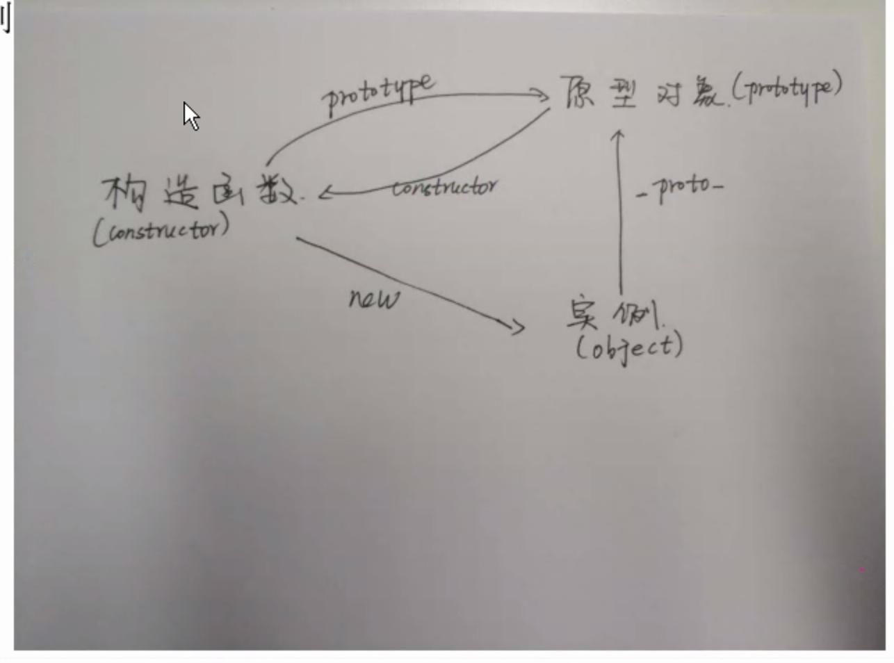


## 原型链

> 每次定义一个函数，都会产生一个作用域链（scope chain）。当JavaScript寻找变量varible时（这个过程称为变量解析），总会优先在当前作用域链的第一个对象中查找属性varible ，如果找到，则直接使用这个属性；否则，继续查找下一个对象的是否存在这个属性；这个过程会持续直至找到这个属性或者最终未找到引发错误为止。

* 访问一个对象的属性时
  * 先在自身属性中查找，找到返回
  * 如果没有，再沿着`__proto__`这条链向上找，找到返回
  * 如果最终没找到就返回`undefined`
* 别名：隐式原型链
* 作用：查找对象的属性(方法)
* 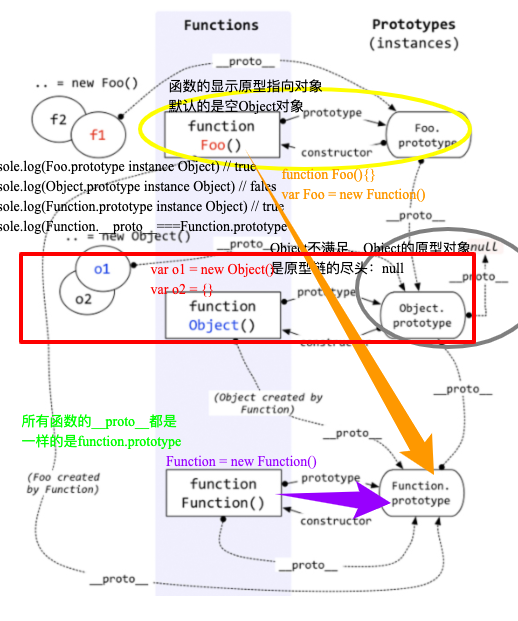


###  new

1. 新生成了一个对象
2. 链接到原型
3. 绑定 this
4. 返回新对象

```js
function create() {
    // 创建一个空的对象
    let obj = new Object()
    // 获得构造函数
    let Con = [].shift.call(arguments)
    // 链接到原型
    obj.__proto__ = Con.prototype
    // 绑定 this，执行构造函数
    let result = Con.apply(obj, arguments)
    // 确保 new 出来的是个对象
    return typeof result === 'object' ? result : obj
}
```


## 继承

ES5->ES6

## 深浅拷贝


```js
function deepCopy(target){ 
let copyed_objs = [];//此数组解决了循环引用和相同引用的问题，它存放已经递归到的目标对象 
    function _deepCopy(target){ 
        if((typeof target !== 'object')||!target){return target;}
        for(let i= 0 ;i<copyed_objs.length;i++){
            if(copyed_objs[i].target === target){
                return copyed_objs[i].copyTarget;
            }
        }
        let obj = {};
        if(Array.isArray(target)){
            obj = [];//处理target是数组的情况 
        }
        copyed_objs.push({target:target,copyTarget:obj}) 
        Object.keys(target).forEach(key=>{ 
            if(obj[key]){ return;} 
            obj[key] = _deepCopy(target[key]);
        }); 
        return obj;
    } 
    return _deepCopy(target);
}
```


## DOM

| ECMAScript(核心)      | 描述了JS的语法和基本对象。 |
| --------------------- | -------------------------- |
| 文档对象模型 （DOM）  | 处理网页内容的方法和接口   |
| 浏览器对象模型（BOM） | 与浏览器交互的方法和接口   |

### 事件监听，事件绑定，事件委托

假如你使用的是事件监听你可以这样写

```js
var li =document.getElementsByTagName('li')
    for (let i=0;i<li.length;i++){
        li[i].onclick=function () {
            console.log(li[i].innerHTML)
        }
}
```

同样你可以使用事件委托

```js
var ul=document.getElementById('no')
    ul.onclick=function (e) {
        var target = e.target ;
        if(target.tagName.toLowerCase() === "li"){
            console.log(target.innerHTML)
        }
    }
```


## commonJS

```js
// 模块引入
let moduleA = require('./a.js')

// 模块导出
module.exports = () => {}
```

* 源码实现：

```js
let fs = require('fs')
// 查找module
function myReq (myModule) {
  // 读取文件信息
  let cont = fs.readFileSync(myModule, 'utf-8')
  /* function (exports, require, module, __filename, __dirname) {
    moduel.exports = {a: 'apple'}
    return moduel.exports
  } */
  let nodeFn = new Function('exports', 'require', 'module', '__filename', '__dirname', cont + 'return module.exports')
  let module = {
    exports: {}
  }
  return nodeFn(module.exports, myReq, module, __filename, __dirname)
}
// let getA = require('./a')
let getA = myReq('./a.js')
console.log(getA, 'getA')
```


## ES6

```js
// 模块引入
import {moduleA} from './a.js'

// 模块导出
export default () => {}
```

Es6 新特性

箭头函数和普通函数的区别

## 跨域

同域的要求
	1.协议相同
	2.域名相同
	3.端口相同

### 跨域

1、 通过jsonp跨域

*因为 jsonp 是通过插入一个 script 标签，利用 script 可以跨域请求来实现的*

```html
<!DOCTYPE html>
<html>
  <head>
    <meta charset="utf-8">
  </head>
  <body>
    <script type='text/javascript'>
      // 后端返回直接执行的方法，相当于执行这个方法，由于后端把返回的数据放在方法的参数里，所以这里能拿到res。
      window.jsonpCb = function (res) {
        console.log(res)
      }
    </script>
    <script src='http://localhost:9871/api/jsonp?msg=helloJsonp&cb=jsonpCb' type='text/javascript'></script>
  </body>
</html>
```

2.CORS  需要服务器设置header ：Access-Control-Allow-Origin。


Access-Control-Allow-Origin: 必写（*） ,代表着允许所有域名的跨域请求，
Access-Control-Allow-Credentials: 可写，该值是一个布尔值，表示是否允许发送Cookie,默认情况下，Cookie不包括CORS请求中。

Access-Control-Expose-Header： 在CORS请求时浏览器的XMLHttpRequest对象的getResponseHeader()方法只可以拿到六个基本字段，如果还想拿到其他字段就必须在Access-Control-Expose-Header中指定


3.nginx反向代理 这个方法一般很少有人提及，但是他可以不用目标服务器配合，不过需要你搭建一个中转nginx服务器，用于转发请求。

### 访问跨域的页面

4，html5的 postMessage+iframe 这个也是需要目标服务器或者说是目标页面写一个postMessage，主要侧重于前端通讯。


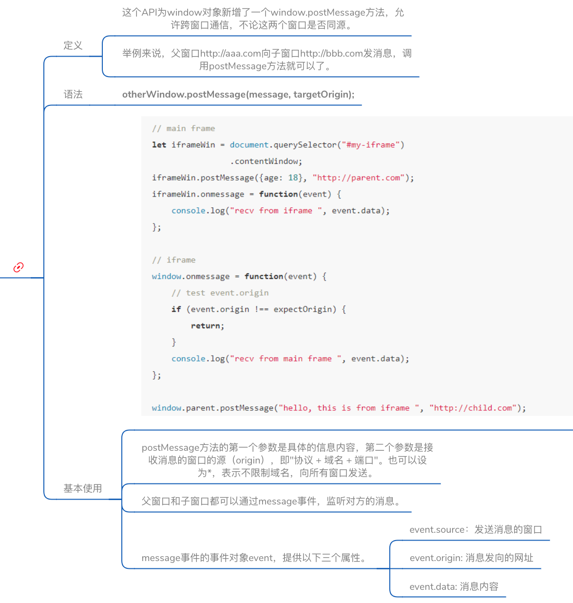


**WebSocket协议跨域**


## get post 请求的区别

* GET在浏览器回退时是无害的，而POST会再次提交请求。

* GET请求会被浏览器主动cache，而POST不会，除非手动设置

* GET请求只能进行url编码，而POST支持多种编码方式。

* GET请求参数会被完整保留在浏览器历史记录里，而POST中的参数不会被保留

* GET请求在URL中传送的参数是有长度限制的，而POST没有限制。

* GET产生的URL地址可以被Bookmark，而POST不可以。

* GET比POST更不安全，因为参数直接暴露在URL上，所以不能用来传递敏感信息。

* GET参数通过URL传递，POST放在Request body中。

* 对参数的数据类型，GET只接受ASCII字符，而POST没有限制。

* GET产生一个TCP数据包；POST产生两个TCP数据包。

  *  对于GET方式的请求，浏览器会把http header和data一并发送出去，服务器响应200（返回数据）；

  * 而对于POST，浏览器先发送header，服务器响应100 continue，浏览器再发送data，服务器响应200 ok（返回数据）

## 异步大杂烩

JS中异步编程的方法有：

- 回调函数
- 事件监听
- 发布/订阅
- 产生服务器交互异步的原因
  * 简单来说，需要去后台查询数据库，拿到数据再进行下一步操作。需要注意下面两种情况
      1）不能让用户等待，网络之间传递数据，可能存在网络延迟，数据库操作失败等等意外情况；
      2）不要刷新页面，web的工作原理，一个http请求需要一个页面，如果需要再刷新页面，会打断用户。

- 服务器交互的异步（Ajax---->Promise---->Fetch）

- - Ajax

  - Promise

  - Fetch

    * 既然有promise和ajax，我是不是可以把两者的优点结合起来，fetch应运而生。fetch呢，其实也没啥好说的，简单来说就是ajax的替代品，不过fetch基于Promise的方式，但是它和ajax有亮点不太一样。
        1) 当接收到一个代表错误的 HTTP 状态码时，从 fetch()返回的 Promise 不会被标记为 reject， 即使该 HTTP 响应的状态码是 404 或 500。相反，它会将 Promise 状态标记为 resolve （但是会将 resolve 的返回值的 ok 属性设置为 false ），仅当网络故障时或请求被阻止时，才会标记为 reject。
        2) 默认情况下，fetch 不会从服务端发送或接收任何 cookies, 如果站点依赖于用户 session，则会导致未经认证的请求（要发送 cookies，必须设置 credentials 选项）。

    ```http
    postData('http://example.com/answer', {answer: 42})
      .then(data => console.log(data)) // JSON from `response.json()` call
      .catch(error => console.error(error))
    function postData(url, data) {
      // Default options are marked with *
      return fetch(url, {
        body: JSON.stringify(data), // must match 'Content-Type' header
        cache: 'no-cache', // *default, no-cache, reload, force-cache, only-if-cached
        credentials: 'same-origin', // include, same-origin, *omit
        headers: {
          'user-agent': 'Mozilla/4.0 MDN Example',
          'content-type': 'application/json'
        },
        method: 'POST', // *GET, POST, PUT, DELETE, etc.
        mode: 'cors', // no-cors, cors, *same-origin
        redirect: 'follow', // manual, *follow, error
        referrer: 'no-referrer', // *client, no-referrer
      })
      .then(response => response.json()) // parses response to JSON
    }
    ```

    

- - async/await(ES6)

- promise
- generator（ES6）
- async/await(ES7)

* * 虽然使用了fetch，但是还是有回调的影子，能不能再美观一下，async/await出来了，async/await就是generator的语法糖，可以让异步和同步编写一样.


#  微信小程序

##  小程序文件类型

####  app.json[配置文件]

必须要有这个文件，如果没有这个文件，项目无法运行，因为微信小程序把这个作为配置文件入口，是当前小程序的全局配置，包括了小程序的所有页面路径、界面表现、网络超时时间、底部 tab 等。

####  app.js[全局]

必须要有这个文件，没有也会报错！这个文件创建一下就行，可以什么都不写，以后我们可以在这个文件中监听并处理小程序的生命周期函数、声明全局变量。

####  project.config.json[工具配置]

小程序工具的个性化配置，例如界面颜色、编译配置等等。

#### page里的文件

**WXML模板：**和HTML非常像，WXML由标签属性等构成，但是和HTML也有很多不一样的地方，例如：

- 标签名字不一样，写 HTML 的时候，经常会用到的标签是 `div`, `p`, `span`，而小程序的 `WXML` 用的标签是 `view`, `button`, `text` 等等
- 多了一些 `wx:if` 这样的属性以及 `{{ }}` 这样的表达式

**WXSS 样式：**WXSS 具有 CSS 大部分的特性，小程序在 WXSS 也做了一些扩充和修改。

- 新增了尺寸单位rpx。1rpx=0.5px=1物理像素
- 提供了全局的样式和局部样式。你可以写一个 `app.wxss` 作为全局样式，会作用于当前小程序的所有页面，局部页面样式 `page.wxss` 仅对当前页面生效。
- 此外 `WXSS` 仅支持部分 `CSS` 选择器

**JS 交互逻辑：**一个服务仅仅只有界面展示是不够的，还需要和用户做交互：响应用户的点击、获取用户的位置等等。在小程序里边，我们就通过编写 `JS`脚本文件来处理用户的操作。

**页面配置page.json：**独立定义每个页面的一些属性，例如顶部颜色、是否允许下拉刷新等等。

### 总结

* project.config.json 项目配置文件，用得最多的就是配置是否开启https校验；

* App.js   设置一些全局的基础数据等；

* App.json 底部tab, 标题栏和路由等设置；

* App.wxss 公共样式，引入iconfont等；

* pages 里面包含一个个具体的页面；

* index.json (配置当前页面标题和引入组件等)；

* index.wxml (页面结构)；

* index.wxss (页面样式表)；

* index.js (页面的逻辑，请求和数据处理等)；


# 性能优化相关

## CRP（关键渲染路径）首屏加载

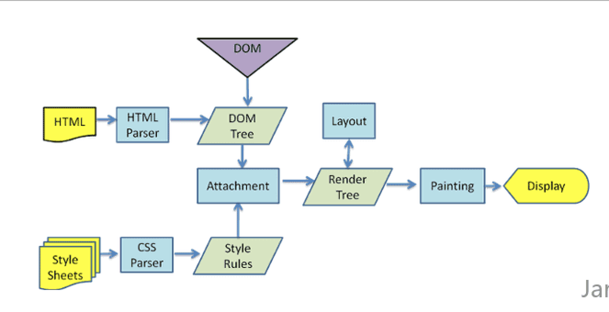

浏览器渲染

# 缓存

## 浏览器缓存机制:强缓存，协商缓存

良好的缓存策略可以降低资源的重复加载提高网页的整体加载速度

- #### 浏览器请求数据流程：基本原理

  - 浏览器在加载资源时，根据请求头的`expires`和`cache-control`判断是否命中强缓存，是则直接从缓存读取资源，不会发请求到服务器。
  - 如果没有命中强缓存，浏览器一定会发送一个请求到服务器，通过`last-modified`和`etag`验证资源是否命中协商缓存，如果命中，服务器会将这个请求返回，但是不会返回这个资源的数据，依然是从缓存中读取资源
  - 如果前面两者都没有命中，直接从服务器加载资源

* ####  相同点

如果命中，都是从客户端缓存中加载资源，而不是从服务器加载资源数据；

* ####   不同点

强缓存不发请求到服务器，协商缓存会发请求到服务器

### 强缓存

强缓存通过`Expires`和`Cache-Control`两种响应头实现

#### 1. Expires

Expires是`http1.0`  提出的一个表示资源过期时间的header，它描述的是一个绝对时间，由服务器返回。
Expires 受限于本地时间，如果修改了本地时间，可能会造成缓存失效

```
Expires: Wed, 11 May 2018 07:20:00 GMT
```

####  2. Cache-Control

Cache-Control 出现于`HTTP / 1.1` ，优先级高于 Expires ,表示的是相对时间

```
Cache-Control: max-age=315360000(单位：秒)
```

HTTP1.1版本`Cache-Control`优先级高于`Expires`

HTTP1.0版本`Cache-Control`会被忽略

### 协商缓存

协商缓存是利用的是`【Last-Modified，If-Modified-Since】`和`【ETag、If-None-Match】`这两对Header来管理的

####  1.  Last-Modified，If-Modified-Since

`Last-Modified` 表示本地文件最后修改日期，浏览器会在request header加上`If-Modified-Since`（上次返回的`Last-Modified`的值），询问服务器在该日期后资源是否有更新，有更新的话就会将新的资源发送回来

#### 2. ETag、If-None-Match


#  排序


大数算阶乘n！

```js
function f(n) {
// a代表结果 [0]是个位依次类推
    var a = [1];
    for (var i = 1; i <= n; i++) {
        // 判断条件可以理解为为 在j大于当前被乘数的位数的时候，存在进位则强制将a扩增一个位数
        for (var j = 0, c = 0; j < a.length || c != 0; j++) {
            // 每次执行这一此循环时
            // 将进位数归0,当前位数归0,然后从当前位数开始与阶乘数i相乘
            // 用m保存相乘的结果（阶乘数*当前位数+上一位的进位数）
            // 把当前位数设置为m对10取模
            // 把c设置为进位数也就是减去当前位数再除10
            var m = (j < a.length) ? (i * a[j] + c) : c;
            a[j] = m % 10;
            c = (m - a[j]) / 10;
        }
    }
    return a.reverse().join("");
}
var res =f(0);
```


#  面向对象

工厂模式

发布订阅模式

```js

```


# React


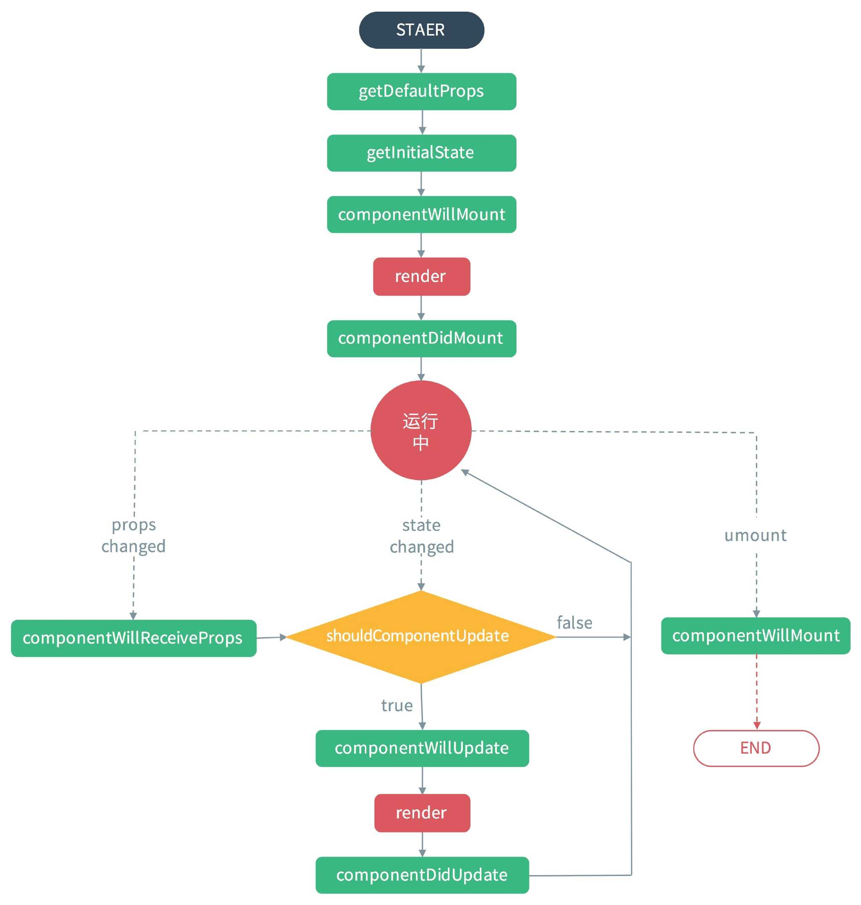

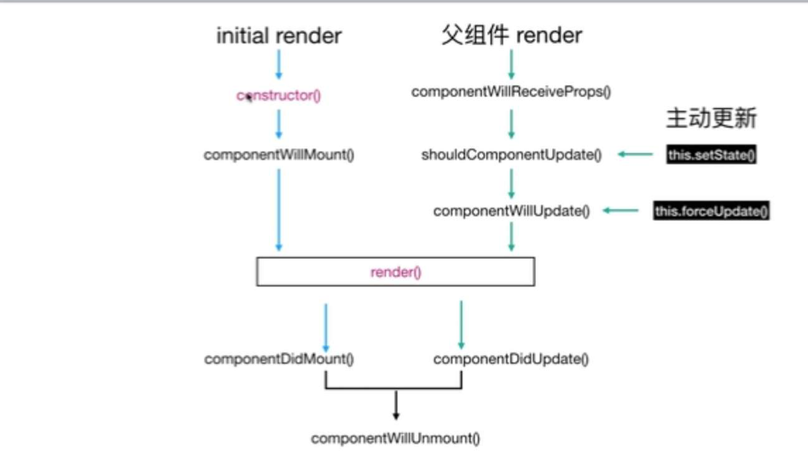

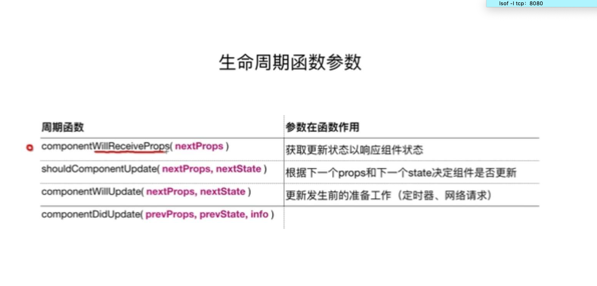

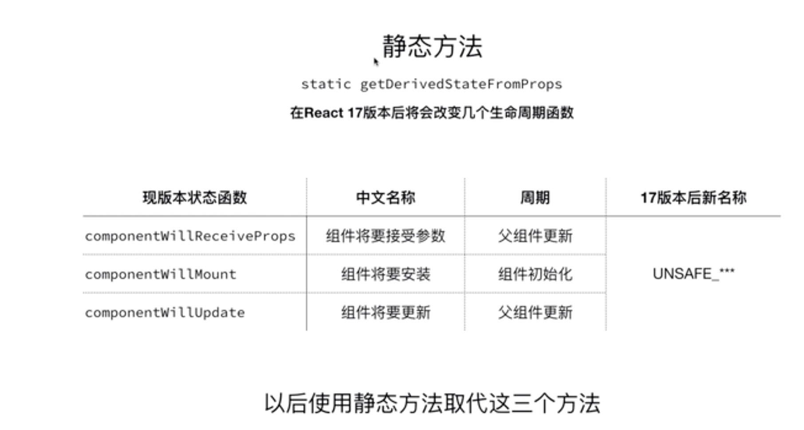

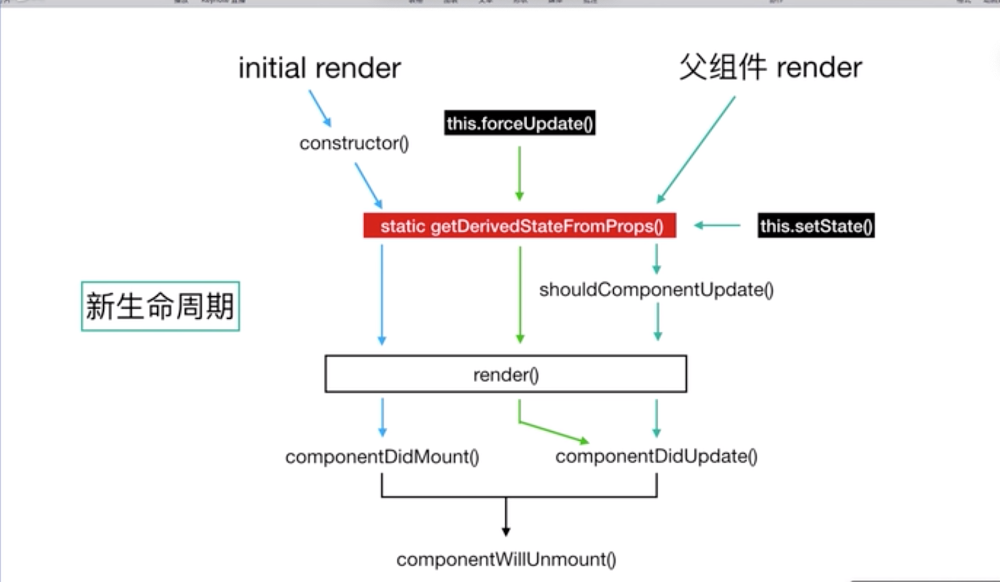


### react 推出新的生命周期的原因

react打算在17版本推出新的Async Rendering，提出一种可被打断的生命周期，而可以被打断的阶段正是实际dom挂载之前的虚拟dom构建阶段，也就是要被去掉的三个生命周期。

生命周期一旦被打断，下次恢复的时候又会再跑一次之前的生命周期，因此componentWillMount，componentWillReceiveProps， componentWillUpdate都不能保证只在挂载/拿到props/状态变化的时候刷新一次了，所以这三个方法被标记为不安全。

### setState

`es6`中可以使用`Promise`更优雅的使用这个函数，封装一下`setState`

```js
function setStateAsync(nextState){
  return new Promise(resolve => {
    this.setState(nextState, resolve);
  });
}
```

也可以这样写：

```js
async func() {
  ...
  await this.setStateAsync({count: this.state.count + 1});
  await this.setStateAsync({count: this.state.count + 1});
}
```


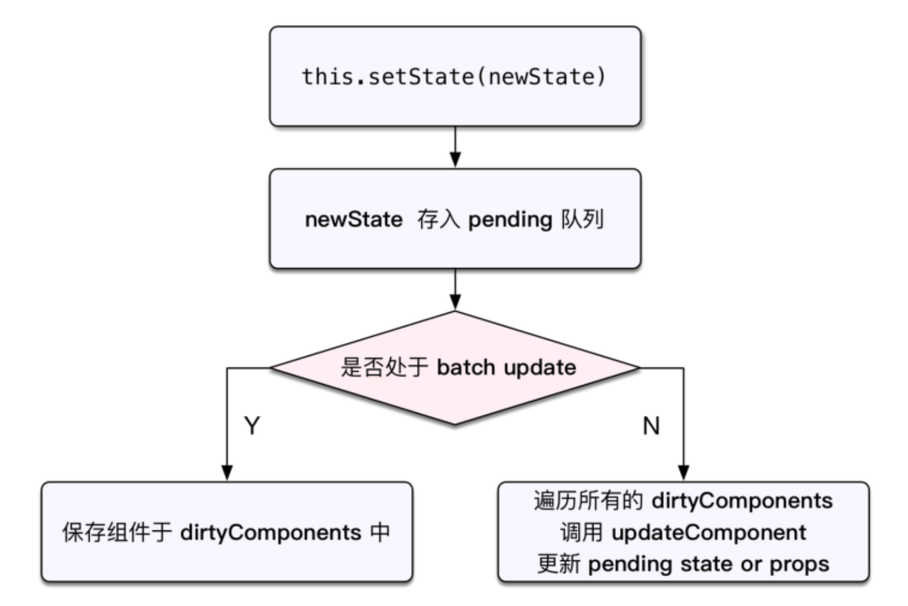


```js
class Example extends React.Component {
  constructor() {
    super();
    this.state = {
      val: 0
    };
  }
  componentDidMount() {
    this.setState({val: this.state.val + 1});
    console.log(this.state.val);    // 第 1 次 log

    this.setState({val: this.state.val + 1});
    console.log(this.state.val);    // 第 2 次 log

    setTimeout(() => {
      this.setState({val: this.state.val + 1});
      console.log(this.state.val);  // 第 3 次 log

      this.setState({val: this.state.val + 1});
      console.log(this.state.val);  // 第 4 次 log
    }, 0);
  }

  render() {
    return null;
  }
};
```

>*因为在 componentDidMount 中调用 setState 时，batchingStrategy 的 isBatchingUpdates 已经被设为 true，所以两次 setState 的结果并没有立即生效，而是被放进了 dirtyComponents 中。这也解释了两次打印this.state.val 都是 0 的原因，新的 state 还没有被应用到组件中。*

> *再反观 setTimeout 中的两次 setState，因为没有前置的 batchedUpdate 调用，所以 batchingStrategy 的 isBatchingUpdates 标志位是 false，也就导致了新的 state 马上生效，没有走到 dirtyComponents 分支。也就是，setTimeout 中第一次 setState 时，this.state.val 为 1，而 setState 完成后打印时 this.state.val 变成了 2。第二次 setState 同理。*

### jsx

* Babel 转译器会把 **JSX** 转换成一个名为 `React.createElement()` 的方法调用。
* 解析的会有：元素，属性，方法

* JSX是将HTML语法加入到Javascript代码中，再通过翻译器转换成纯Javascript后让浏览器执行。实际开发中打包阶段都已将编译成纯Javascript代码，所以不会带来任何副作用，反而让代码更加直观并且易于维护

* 创建元素时候除了使用React.createElement创建之外，其结构与JSON一样。

* JSX实质上就是为了方便React将View层组件化，通过将HTMl语法加到Javascript代码中，以承担构建页面的职责

### React.createElement

其中 `createElement(a, b, c)`

- 第一个参数 a：表示元素的类型，比如：h1, div 等。
- 第二个参数 b：表示该元素上的属性，使用 JavaScript 对象方式表示。
- 第三个参数 c：表示该元素内部的内容，可以是文字，可以继续嵌套另外一个 。

### key值的作用

Keys 是 React 用于追踪哪些列表中元素被修改、被添加或者被移除的辅助标识。

```jsx
render () {
  return (
    <ul>
      {this.state.todoItems.map(({item, key}) => {
        return <li key={key}>{item}</li>
      })}
    </ul>
  )
}
```

在开发过程中，我们需要保证某个元素的 key 在其同级元素中具有唯一性。在 React Diff 算法中 React 会借助元素的 Key 值来判断该元素是新近创建的还是被移动而来的元素，从而减少不必要的元素重渲染。此外，React 还需要借助 Key 值来判断元素与本地状态的关联关系，因此我们绝不可忽视转换函数中 Key 的重要性。


###  高级组件

### HOOKS

**React Hooks 要解决的问题是状态共享**，是继 [render-props](https://link.juejin.im/?target=https%3A%2F%2Freactjs.org%2Fdocs%2Frender-props.html) 和 [higher-order components](https://link.juejin.im/?target=https%3A%2F%2Freactjs.org%2Fdocs%2Fhigher-order-components.html) 之后的第三种状态共享方案，不会产生 JSX 嵌套地狱问题。

* ### 利用 useState 创建 Redux

  Redux 的精髓就是 Reducer，而利用 React Hooks 可以轻松创建一个 Redux 机制：

  ```js
  // 这就是 Redux
  function useReducer(reducer, initialState) {
    const [state, setState] = useState(initialState);
  
    function dispatch(action) {
      const nextState = reducer(state, action);
      setState(nextState);
    }
  
    return [state, dispatch];
  }
  复制代码
  ```

  这个自定义 Hook 的 value 部分当作 redux 的 state，setValue 部分当作 redux 的 dispatch，合起来就是一个 redux。而 react-redux 的 connect 部分做的事情与 Hook 调用一样：

  ```js
  // 一个 Action
  function useTodos() {
    const [todos, dispatch] = useReducer(todosReducer, []);
  
    function handleAddClick(text) {
      dispatch({ type: "add", text });
    }
  
    return [todos, { handleAddClick }];
  }
  
  // 绑定 Todos 的 UI
  function TodosUI() {
    const [todos, actions] = useTodos();
    return (
      <>
        {todos.map((todo, index) => (
          <div>{todo.text}</div>
        ))}
        <button onClick={actions.handleAddClick}>Add Todo</button>
      </>
    );
  }
  
  ```

利用 useEffect 代替一些生命周期

在 useState 位置附近，可以使用 useEffect 处理副作用：

```js
useEffect(() => {
  const subscription = props.source.subscribe();
  return () => {
    // Clean up the subscription
    subscription.unsubscribe();
  };
});
```

### Context

具体而言，**高阶组件就是一个函数，且该函数接受一个组件作为参数，并返回一个新的组件。**

```
const EnhancedComponent = higherOrderComponent(WrappedComponent);
```

对比组件将props属性转变成UI，高阶组件则是将一个组件转换成另一个组件。

高阶组件在React第三方库中很常见，比如Redux的`connect`

### React-router

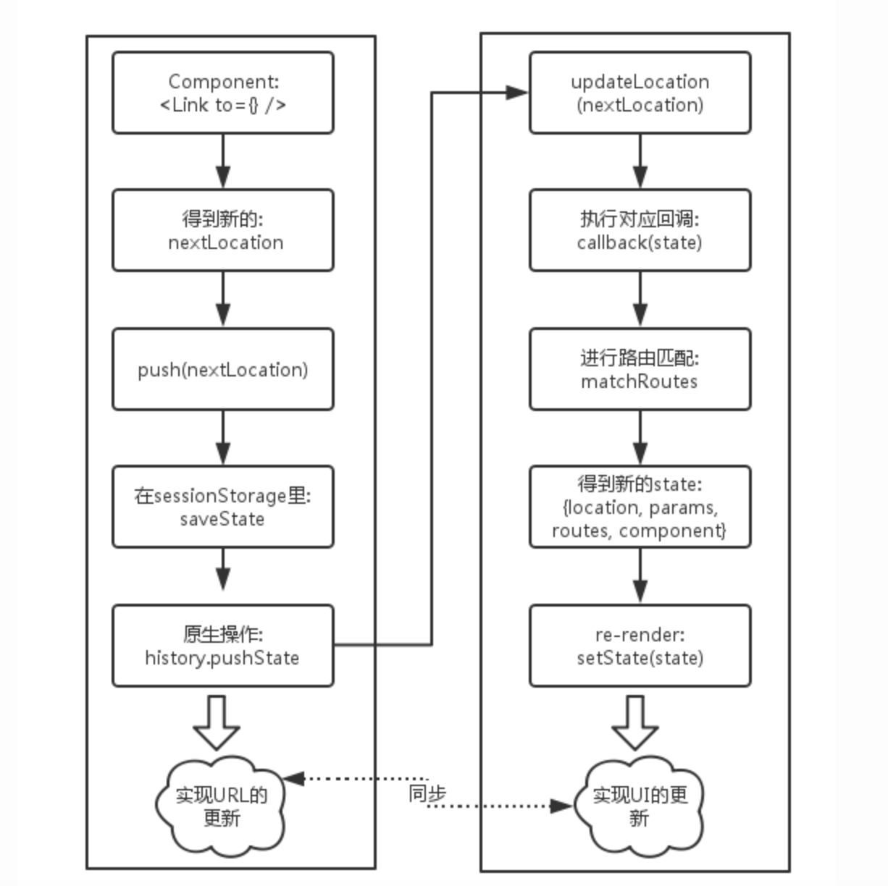

### 单向数据流&React组件传值

* **父子组件间的传值**(通过props来传值)

```html
//父组件
<Es6cComponent nameall="abc"/>
```

```html
//子组件
<div>{this.props.nameall}</div>
```

* **子父组件间的传值**(回调函数)

  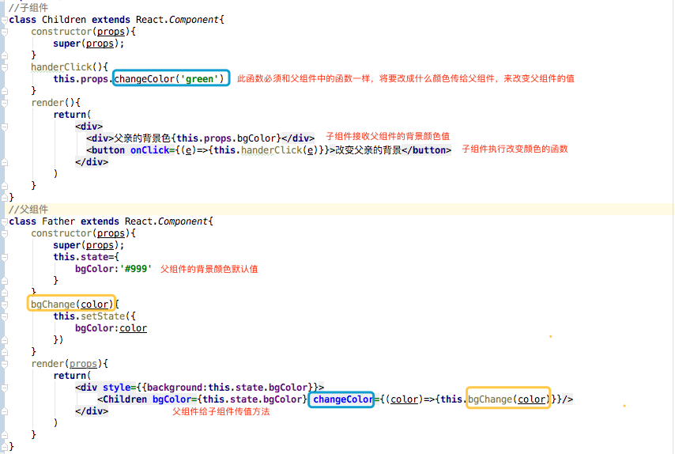

* **兄弟组件传值**(子组件传给父组件，父组件再传给子组件)


### diff算法

- *把树形结构按照层级分解，只比较同级元素。*
- *给列表结构的每个单元添加唯一的 key 属性，方便比较。*
- *React 只会匹配相同 class 的 component（这里面的 class 指的是组件的名字）*
- *合并操作，调用 component 的 setState 方法的时候, React 将其标记为 dirty.到每一个事件循环结束, React 检查所有标记 dirty 的 component 重新绘制.*

### react css 样式

* css as object

  ```jsx
  const divStyle = {
    color: 'blue',
    fontSize: 20,
    WebkitTransition: 'all',
    msTransition: 'all',
  };
  const HelloWorldComponent = () => (
    <div style={divStyle}>Hello World!</div>
  );
  ```

  缺点：

  - 样式属性名称的命名方式与传统 CSS 不同
  - 样式属性名称无法自动提示并补全
  - 样式值略有差异，如上例中的字体大小 `20px` 写为 `20`
  - 无法充分利用自动补全浏览器前缀的功能，需要手动添加前缀
  - 无法抽离成独立的样式文件
  - 无法有效复用基础样式

* css as  function  (polished.js)

* ```js
  import { size } from 'polished';
  const style = {
    ...size('300px', '250px')
  }
  
  // 等效于
  
  const style = {
    height: '300px',
    width: '250px'
  }
  ```

* Css as component(polished.js)

* ```js
  import React from 'react';
  import { render } from 'react-dom';
  import styled from 'styled-components';
  
  const Title = styled.h1`
    font-size: 1.5em;
    text-align: center;
    color: palevioletred;
  `;
  
  const Wrapper = styled.section`
    padding: 4em;
    background: papayawhip;
  `;
  
  render(
    <Wrapper>
      <Title>
        Hello World, this is my first styled component!
      </Title>
    </Wrapper>,
    document.getElementById('root')
  );
  ```

  ### Sass解析：create-react-app

  一种是去node_modules中找到react_scripts 文件->config文件夹->修改webpack.config.dev.js跟webpack.config.prod.js,

  另外一种在npm run eject 生成配置文件的副本，直接修改根目录下的config目录的两个文件也是webpack.config.dev.js跟webpack.config.prod.js,

  –修改webpack.config.dev.js

  修改了原先css的loader配置，以及增加了include跟exclude参数,位于src/styles目录下的css跟scss文件是全局样式，其他目录的scss跟css文件是局部样式

###  在MVC的设计模式下理解react-redux

MVC（Model-View-Controller）的三个角色其实是各司其职：

- model持有UI要展现的数据
- View即UI的展现
- Controller用于控制

以React来说，它就应该只专注于View的呈现，并将这些展现元素封装为Component。这些Component要展现的props可以视为Model所持有的数据。

React扮演的是View的角色，Redux则是Controller，至于Model就是Redux Store中存储的State

执行`action`的目的虽然是修改`Model`，不过在Redux中，我们尽量希望遵循FP的思想设计出所谓的“纯函数”，于是Redux就引入了`reducer`函数，这个函数要做的事情其实就是对`Model`进行`transform`（可以考虑引入immutable.js来存储和操作Modle）。一旦`Model`对象发生了变化（并不是真正发生了变化，而是产生了一个新的Model），Redux就会通知React Component根据新获得的`Model`去重新Render。


概况下来，React+Redux的主体流程为：

- 通过action获得model，并将其作为state存储到Store中；
- 传递给React Component，按照某种设计呈现model数据；
- 调用action发起update请求，从而调用reducer生成新的state存储到Store中；
- redux通知React Component重新Render。 

## redux 异步处理

*redux-thunk 中间件就能够在 action 传递给 reducer 前进行处理。*

##  redux的优缺点

**缺点！！**

- Redux 带来了函数式编程、不可变性思想等等，为了配合这些理念，开发者必须要写很多“模式代码（boilerplate）”，繁琐以及重复是开发者不愿意容忍的。当然也有很多 hack 旨在减少 boilerplate，但目前阶段，可以说 Redux 天生就附着繁琐；
- 使用 Redux，那么你的应用就要用 objects 或者 arrays 描述状态；OMG！
- 使用 Redux，那么你的应用就要使用 plain objects 即 actions ，来描述变化；OMG！
- 使用 Redux，那么你的应用就要使用纯函数去处理变化；OMG！
- 应用中，状态很多都要抽象到 store，那么何时使用 local states 何时接入 Redux store？
- 不能痛痛快快地写业务，一个变化就要对应编写 action（action creator），reducer 等等；
- 和响应式结合函数式的 Mobx 相比，编程体验“打折扣”
- **Redux 可以理解为一个简易的发布订阅系统。那么因此带来的内存消费也许会大一丢丢。**

**优点！！！**

- 便于调试，具体不再展开；
- 便于线上错误收集，只需要发送 states, actions 等快照即可；
- 结合 localStorage 初始化 store；
- 便于服务端渲染；
- 开发在线协作型应用的救命解药；
- 时光旅行 Undo／Redo；
- 便于测试


# Vue

### vuex


# 前端工程化

## webpack

### 核心概念

在了解 Webpack 原理前，需要掌握以下几个核心概念，以方便后面的理解：

- `Entry`：入口，Webpack 执行构建的第一步将从 Entry 开始，可抽象成输入。
- `Module`：模块，在 Webpack 里一切皆模块，一个模块对应着一个文件。Webpack 会从配置的 Entry 开始递归找出所有依赖的模块。
- `Chunk`：代码块，一个 Chunk 由多个模块组合而成，用于代码合并与分割。
- `Loader`：模块转换器，用于把模块原内容按照需求转换成新内容。
- `Plugin`：扩展插件，在 Webpack 构建流程中的特定时机会广播出对应的事件，插件可以监听这些事件的发生，在特定时机做对应的事情。

### webpack Loader Css预处理器

以处理 SCSS 文件为例：

- SCSS 源代码会先交给 `sass-loader` 把 SCSS 转换成 CSS；
- 把 `sass-loader` 输出的 CSS 交给 `css-loader` 处理，找出 CSS 中依赖的资源、压缩 CSS 等；
- 把 `css-loader` 输出的 CSS 交给 `style-loader` 处理，转换成通过脚本加载的 JavaScript 代码；

#设计模式

### 单例模式

单例模式定义：保证一个类仅有一个实例，并提供访问此实例的全局访问点

```js
const Singleton = function() {};

Singleton.getInstance = (function() {
  // 由于es6没有静态类型,故闭包: 函数外部无法访问 instance
  let instance = null;
  return function() {
    // 检查是否存在实例
    if (!instance) {
      instance = new Singleton();
    }
    return instance;
  };
})();

let s1 = Singleton.getInstance();
let s2 = Singleton.getInstance();

console.log(s1 === s2);

```

### 策略模式

* 就是能够把一系列“可互换的”算法封装起来，并根据用户需求来选择其中一种。  
* **策略模式实现的核心**就是：将算法的使用和算法的实现分离。算法的实现交给策略类。算法的使用交给环境类，环境类会根据不同的情况选择合适的算法。  
* **策略模式优缺点** 在使用策略模式的时候，需要了解所有的“策略”（strategy）之间的异同点，才能选择合适的“策略”进行调用。

```js
// 策略类
const strategies = {
  A() {
    console.log("This is stragegy A");
  },
  B() {
    console.log("This is stragegy B");
  }
};

// 环境类
const context = name => {
  return strategies[name]();
};

// 调用策略A
context("A");
// 调用策略B
context("B");

```

### 发布订阅模式

```js
const Event = {
  clientList: {},
  // 绑定事件监听
  listen(key, fn){
    if(! this.clientList[key]){
      this.clientList[key] = [];
    }
    this.clientList[key].push(fn);
    return true;
  },

  // 触发对应事件
  trigger(){
    const key = Array.prototype.shift.apply(arguments),
      fns = this.clientList[key];
    
      if(!fns || fns.length === 0){
        return false;
      }

      for(let fn of fns){
        fn.apply(null, arguments);
      }

      return true;
  },

  // 移除相关事件
  remove(key, fn){
    let fns = this.clientList[key];

    // 如果之前没有绑定事件
    // 或者没有指明要移除的事件
    // 直接返回
    if(!fns || !fn){
      return false;
    }
    
    // 反向遍历移除置指定事件函数
    for(let l = fns.length - 1; l >= 0; l--){
      let _fn = fns[l];
      if(_fn === fn){
        fns.splice(l, 1);
      }
    }

    return true;
  }
}

// 为对象动态安装 发布-订阅 功能
const installEvent = (obj) => {
  for(let key in Event){
    obj[key] = Event[key];
  }
}

let salesOffices = {};
installEvent(salesOffices);

// 绑定自定义事件和回调函数

salesOffices.listen("event01", fn1 = (price) => {
  console.log("Price is", price, "at event01");
})

salesOffices.listen("event02", fn2 = (price) => {
  console.log("Price is", price, "at event02");
})

salesOffices.trigger("event01", 1000);
salesOffices.trigger("event02", 2000);

salesOffices.remove("event01", fn1);

// 输出: false
// 说明删除成功
console.log(salesOffices.trigger("event01", 1000));


```


# http

下面是常见的HTTP状态码：

- 200 - 请求成功
- 301 - 资源（网页等）被永久转移到其它URL
- 404 - 请求的资源（网页等）不存在
- 500 - 内部服务器错误

## HTTP状态码分类

HTTP状态码由三个十进制数字组成，第一个十进制数字定义了状态码的类型，后两个数字没有分类的作用。HTTP状态码共分为5种类型：

| 分类 | 分类描述                                       |
| :--- | :--------------------------------------------- |
| 1**  | 信息，服务器收到请求，需要请求者继续执行操作   |
| 2**  | 成功，操作被成功接收并处理                     |
| 3**  | 重定向，需要进一步的操作以完成请求             |
| 4**  | 客户端错误，请求包含语法错误或无法完成请求     |
| 5**  | 服务器错误，服务器在处理请求的过程中发生了错误 |

HTTP状态码列表:

| 状态码 | 状态码英文名称                  | 中文描述                                                     |
| :----- | :------------------------------ | :----------------------------------------------------------- |
| 100    | Continue                        | 继续。[客户端](http://www.dreamdu.com/webbuild/client_vs_server/)应继续其请求 |
| 101    | Switching Protocols             | 切换协议。服务器根据客户端的请求切换协议。只能切换到更高级的协议，例如，切换到HTTP的新版本协议 |
|        |                                 |                                                              |
| 200    | OK                              | 请求成功。一般用于GET与POST请求                              |
| 201    | Created                         | 已创建。成功请求并创建了新的资源                             |
| 202    | Accepted                        | 已接受。已经接受请求，但未处理完成                           |
| 203    | Non-Authoritative Information   | 非授权信息。请求成功。但返回的meta信息不在原始的服务器，而是一个副本 |
| 204    | No Content                      | 无内容。服务器成功处理，但未返回内容。在未更新网页的情况下，可确保浏览器继续显示当前文档 |
| 205    | Reset Content                   | 重置内容。服务器处理成功，用户终端（例如：浏览器）应重置文档视图。可通过此返回码清除浏览器的表单域 |
| 206    | Partial Content                 | 部分内容。服务器成功处理了部分GET请求                        |
|        |                                 |                                                              |
| 300    | Multiple Choices                | 多种选择。请求的资源可包括多个位置，相应可返回一个资源特征与地址的列表用于用户终端（例如：浏览器）选择 |
| 301    | Moved Permanently               | 永久移动。请求的资源已被永久的移动到新URI，返回信息会包括新的URI，浏览器会自动定向到新URI。今后任何新的请求都应使用新的URI代替 |
| 302    | Found                           | 临时移动。与301类似。但资源只是临时被移动。客户端应继续使用原有URI |
| 303    | See Other                       | 查看其它地址。与301类似。使用GET和POST请求查看               |
| 304    | Not Modified                    | 未修改。所请求的资源未修改，服务器返回此状态码时，不会返回任何资源。客户端通常会缓存访问过的资源，通过提供一个头信息指出客户端希望只返回在指定日期之后修改的资源 |
| 305    | Use Proxy                       | 使用代理。所请求的资源必须通过代理访问                       |
| 306    | Unused                          | 已经被废弃的HTTP状态码                                       |
| 307    | Temporary Redirect              | 临时重定向。与302类似。使用GET请求重定向                     |
|        |                                 |                                                              |
| 400    | Bad Request                     | 客户端请求的语法错误，服务器无法理解                         |
| 401    | Unauthorized                    | 请求要求用户的身份认证                                       |
| 402    | Payment Required                | 保留，将来使用                                               |
| 403    | Forbidden                       | 服务器理解请求客户端的请求，但是拒绝执行此请求               |
| 404    | Not Found                       | 服务器无法根据客户端的请求找到资源（网页）。通过此代码，网站设计人员可设置"您所请求的资源无法找到"的个性页面 |
| 405    | Method Not Allowed              | 客户端请求中的方法被禁止                                     |
| 406    | Not Acceptable                  | 服务器无法根据客户端请求的内容特性完成请求                   |
| 407    | Proxy Authentication Required   | 请求要求代理的身份认证，与401类似，但请求者应当使用代理进行授权 |
| 408    | Request Time-out                | 服务器等待客户端发送的请求时间过长，超时                     |
| 409    | Conflict                        | 服务器完成客户端的PUT请求是可能返回此代码，服务器处理请求时发生了冲突 |
| 410    | Gone                            | 客户端请求的资源已经不存在。410不同于404，如果资源以前有现在被永久删除了可使用410代码，网站设计人员可通过301代码指定资源的新位置 |
| 411    | Length Required                 | 服务器无法处理客户端发送的不带Content-Length的请求信息       |
| 412    | Precondition Failed             | 客户端请求信息的先决条件错误                                 |
| 413    | Request Entity Too Large        | 由于请求的实体过大，服务器无法处理，因此拒绝请求。为防止客户端的连续请求，服务器可能会关闭连接。如果只是服务器暂时无法处理，则会包含一个Retry-After的响应信息 |
| 414    | Request-URI Too Large           | 请求的URI过长（URI通常为网址），服务器无法处理               |
| 415    | Unsupported Media Type          | 服务器无法处理请求附带的媒体格式                             |
| 416    | Requested range not satisfiable | 客户端请求的范围无效                                         |
| 417    | Expectation Failed              | 服务器无法满足Expect的请求头信息                             |
|        |                                 |                                                              |
| 500    | Internal Server Error           | 服务器内部错误，无法完成请求                                 |
| 501    | Not Implemented                 | 服务器不支持请求的功能，无法完成请求                         |
| 502    | Bad Gateway                     | 作为网关或者代理工作的服务器尝试执行请求时，从远程服务器接收到了一个无效的响应 |
| 503    | Service Unavailable             | 由于超载或系统维护，服务器暂时的无法处理客户端的请求。延时的长度可包含在服务器的Retry-After头信息中 |
| 504    | Gateway Time-out                | 充当网关或代理的服务器，未及时从远端服务器获取请求           |
| 505    | HTTP Version not supported      | 服务器不支持请求的HTTP协议的版本，无法完成处理               |

## DNS 解析过程


### 三次握手四次挥手

**三次握手：**

所谓**三次握手**(Three-way Handshake)，是指建立一个 TCP 连接时，需要客户端和服务器总共发送3个包。

三次握手的目的是连接服务器指定端口，建立 TCP 连接，并同步连接双方的序列号和确认号，交换 TCP 窗口大小信息。在 socket 编程中，客户端执行 `connect()` 时。将触发三次握手。

- 第一次握手(SYN=1, seq=x):

  客户端发送一个 TCP 的 SYN 标志位置1的包，指明客户端打算连接的服务器的端口，以及初始序号 X,保存在包头的序列号(Sequence Number)字段里。

  发送完毕后，客户端进入 `SYN_SEND` 状态。

- 第二次握手(SYN=1, ACK=1, seq=y, ACKnum=x+1):

  服务器发回确认包(ACK)应答。即 SYN 标志位和 ACK 标志位均为1。服务器端选择自己 ISN 序列号，放到 Seq 域里，同时将确认序号(Acknowledgement Number)设置为客户的 ISN 加1，即X+1。 发送完毕后，服务器端进入 `SYN_RCVD` 状态。

- 第三次握手(ACK=1，ACKnum=y+1)

  客户端再次发送确认包(ACK)，SYN 标志位为0，ACK 标志位为1，并且把服务器发来 ACK 的序号字段+1，放在确定字段中发送给对方，并且在数据段放写ISN的+1

  发送完毕后，客户端进入 `ESTABLISHED` 状态，当服务器端接收到这个包时，也进入 `ESTABLISHED`状态，TCP 握手结束。

**四次挥手**

TCP 的连接的拆除需要发送四个包，因此称为**四次挥手**(Four-way handshake)，也叫做改进的三次握手。客户端或服务器均可主动发起挥手动作，在 socket 编程中，任何一方执行 `close()` 操作即可产生挥手操作。

- 第一次挥手(FIN=1，seq=x)

  假设客户端想要关闭连接，客户端发送一个 FIN 标志位置为1的包，表示自己已经没有数据可以发送了，但是仍然可以接受数据。

  发送完毕后，客户端进入 `FIN_WAIT_1` 状态。

- 第二次挥手(ACK=1，ACKnum=x+1)

  服务器端确认客户端的 FIN 包，发送一个确认包，表明自己接受到了客户端关闭连接的请求，但还没有准备好关闭连接。

  发送完毕后，服务器端进入 `CLOSE_WAIT` 状态，客户端接收到这个确认包之后，进入 `FIN_WAIT_2` 状态，等待服务器端关闭连接。

- 第三次挥手(FIN=1，seq=y)

  服务器端准备好关闭连接时，向客户端发送结束连接请求，FIN 置为1。

  发送完毕后，服务器端进入 `LAST_ACK` 状态，等待来自客户端的最后一个ACK。

- 第四次挥手(ACK=1，ACKnum=y+1)

  客户端接收到来自服务器端的关闭请求，发送一个确认包，并进入 `TIME_WAIT`状态，等待可能出现的要求重传的 ACK 包。

  服务器端接收到这个确认包之后，关闭连接，进入 `CLOSED` 状态。

  客户端等待了某个固定时间（两个最大段生命周期，2MSL，2 Maximum Segment Lifetime）之后，没有收到服务器端的 ACK ，认为服务器端已经正常关闭连接，于是自己也关闭连接，进入 `CLOSED` 状态。

#  前端SEO优化

- `*<head>*`*标签放网页的标题，各个页面不同。*
- `*<meta keywords>*`*列举出几个重要的关键词。*
- `*<meta description>*`*网页内容的高度概括。*
- `*<br />*`*标记应该放在文本中间，即使用*`*<p><br /></p>*`*替代突兀的*`*<br />*`*标记。*
- *html语义化。例如我们要做一个导航，可以使用*`*div*`*+*`*span*`*标记：*
- `img alt`其实搜索引擎在分析页面的时候，也会根据这个词去判断图片的内容

*有了nodejs后主流做法是前后端同构方案，即一套代码在浏览器端和node端都可以运行，从而可以先在node端请求数据渲染模板，然后将渲染结果返回给浏览器最终呈现，是目前最完美的前后端分离+SEO解决方案，目测没有之一*